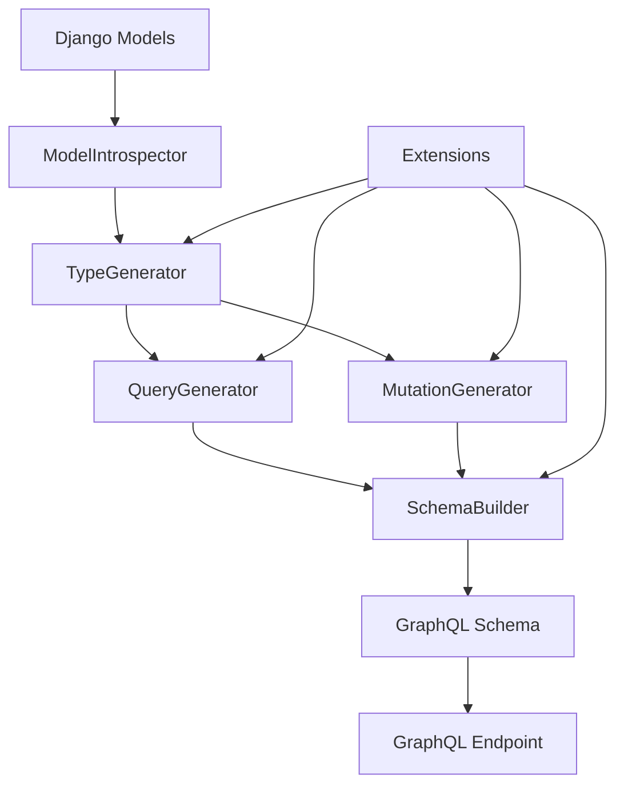

# Developer Guide

This guide provides comprehensive information for developers who want to understand, extend, or contribute to the Django GraphQL Auto-Generation Library.

## 📚 Table of Contents

- [Architecture Overview](#architecture-overview)
- [Core Components](#core-components)
- [Extension Development](#extension-development)
- [Custom Generators](#custom-generators)
- [Testing Framework](#testing-framework)
- [Performance Optimization](#performance-optimization)
- [Contributing Guidelines](#contributing-guidelines)
- [Debugging & Troubleshooting](#debugging--troubleshooting)

## 🏗️ Architecture Overview

### System Architecture

The Django GraphQL Auto-Generation Library follows a modular, plugin-based architecture:

```
┌─────────────────────────────────────────────────────────────┐
│                    GraphQL Schema Layer                     │
├─────────────────────────────────────────────────────────────┤
│  Query Types  │  Mutation Types  │  Subscription Types     │
├─────────────────────────────────────────────────────────────┤
│                   Generation Layer                          │
├─────────────────────────────────────────────────────────────┤
│ TypeGenerator │ QueryGenerator │ MutationGenerator │ etc.  │
├─────────────────────────────────────────────────────────────┤
│                   Extension Layer                           │
├─────────────────────────────────────────────────────────────┤
│ Permissions │ Caching │ Rate Limiting │ File Uploads │ etc. │
├─────────────────────────────────────────────────────────────┤
│                     Core Layer                              │
├─────────────────────────────────────────────────────────────┤
│ ModelIntrospector │ TypeRegistry │ SchemaBuilder │ Config  │
├─────────────────────────────────────────────────────────────┤
│                   Django Models                             │
└─────────────────────────────────────────────────────────────┘
```

### Design Principles

1. **Modularity**: Each component has a single responsibility
2. **Extensibility**: Easy to add new generators and extensions
3. **Configuration-driven**: Behavior controlled through settings
4. **Performance-first**: Optimized for production use
5. **Security-aware**: Built-in security features and best practices

### Data Flow



## 🔧 Core Components

### ModelIntrospector

The `ModelIntrospector` analyzes Django models and extracts metadata:

```python
# rail_django_graphql/generators/introspector.py
from typing import Dict, List, Type, Any
from django.db import models
from dataclasses import dataclass

@dataclass
class FieldInfo:
    """Information about a Django model field."""
    name: str
    field_type: Type
    django_field: models.Field
    is_required: bool
    is_unique: bool
    max_length: Optional[int]
    choices: Optional[List[Tuple]]
    help_text: str
    verbose_name: str

@dataclass
class RelationshipInfo:
    """Information about model relationships."""
    name: str
    related_model: Type[models.Model]
    relationship_type: str  # 'foreign_key', 'many_to_many', 'one_to_one'
    reverse_name: Optional[str]
    through_model: Optional[Type[models.Model]]

class ModelIntrospector:
    """Analyzes Django models for GraphQL schema generation."""

    def __init__(self, config: Optional[Config] = None):
        self.config = config or Config()
        self._cache = {}

    def analyze_model(self, model: Type[models.Model]) -> ModelAnalysis:
        """
        Analyze a Django model and return comprehensive metadata.

        Args:
            model: Django model class to analyze

        Returns:
            ModelAnalysis object with complete model information
        """
        if model in self._cache:
            return self._cache[model]

        analysis = ModelAnalysis(
            model=model,
            model_name=model.__name__,
            app_label=model._meta.app_label,
            table_name=model._meta.db_table,
            fields=self._analyze_fields(model),
            relationships=self._analyze_relationships(model),
            methods=self._analyze_methods(model),
            meta_options=self._analyze_meta_options(model),
        )

        self._cache[model] = analysis
        return analysis

    def _analyze_fields(self, model: Type[models.Model]) -> Dict[str, FieldInfo]:
        """Analyze model fields."""
        fields = {}

        for field in model._meta.get_fields():
            if not field.is_relation:
                field_info = FieldInfo(
                    name=field.name,
                    field_type=type(field),
                    django_field=field,
                    is_required=not field.null and not field.blank,
                    is_unique=field.unique,
                    max_length=getattr(field, 'max_length', None),
                    choices=getattr(field, 'choices', None),
                    help_text=getattr(field, 'help_text', ''),
                    verbose_name=getattr(field, 'verbose_name', field.name),
                )
                fields[field.name] = field_info

        return fields

    def _analyze_relationships(self, model: Type[models.Model]) -> Dict[str, RelationshipInfo]:
        """Analyze model relationships."""
        relationships = {}

        for field in model._meta.get_fields():
            if field.is_relation:
                rel_info = RelationshipInfo(
                    name=field.name,
                    related_model=field.related_model,
                    relationship_type=self._get_relationship_type(field),
                    reverse_name=getattr(field, 'related_name', None),
                    through_model=getattr(field, 'through', None),
                )
                relationships[field.name] = rel_info

        return relationships
```

### TypeGenerator

The `TypeGenerator` creates GraphQL types from Django models:

```python
# rail_django_graphql/generators/types.py
import graphene
from graphene_django import DjangoObjectType
from typing import Type, Dict, Any

class TypeGenerator:
    """Generates GraphQL types from Django models."""

    def __init__(self, config: Optional[Config] = None):
        self.config = config or Config()
        self.type_registry = TypeRegistry()

    def generate_type(self, model: Type[models.Model]) -> Type[DjangoObjectType]:
        """
        Generate a GraphQL type for a Django model.

        Args:
            model: Django model class

        Returns:
            GraphQL ObjectType class
        """
        if self.type_registry.has_type(model):
            return self.type_registry.get_type(model)

        # Create dynamic type class
        type_name = f"{model.__name__}Type"

        # Generate Meta class
        meta_attrs = {
            'model': model,
            'fields': self._get_fields_for_model(model),
            'interfaces': self._get_interfaces_for_model(model),
        }

        # Create Meta class
        meta_class = type('Meta', (), meta_attrs)

        # Generate type attributes
        type_attrs = {
            'Meta': meta_class,
            **self._generate_custom_fields(model),
            **self._generate_resolvers(model),
        }

        # Create the GraphQL type
        graphql_type = type(type_name, (DjangoObjectType,), type_attrs)

        # Register the type
        self.type_registry.register_type(model, graphql_type)

        return graphql_type

    def _get_fields_for_model(self, model: Type[models.Model]) -> List[str]:
        """Get fields to include in GraphQL type."""
        introspector = ModelIntrospector(self.config)
        analysis = introspector.analyze_model(model)

        fields = []

        # Add regular fields
        for field_name, field_info in analysis.fields.items():
            if self._should_include_field(field_info):
                fields.append(field_name)

        # Add relationships
        for rel_name, rel_info in analysis.relationships.items():
            if self._should_include_relationship(rel_info):
                fields.append(rel_name)

        return fields

    def _generate_custom_fields(self, model: Type[models.Model]) -> Dict[str, Any]:
        """Generate custom fields for the GraphQL type."""
        custom_fields = {}

        # Add computed fields
        if hasattr(model, 'GraphQLMeta'):
            meta = model.GraphQLMeta
            if hasattr(meta, 'computed_fields'):
                for field_name in meta.computed_fields:
                    custom_fields[field_name] = graphene.String()

        return custom_fields

    def _generate_resolvers(self, model: Type[models.Model]) -> Dict[str, Any]:
        """Generate resolver methods for custom fields."""
        resolvers = {}

        # Add custom resolvers
        if hasattr(model, 'GraphQLMeta'):
            meta = model.GraphQLMeta
            if hasattr(meta, 'resolver_class'):
                resolver_class = meta.resolver_class
                for method_name in dir(resolver_class):
                    if method_name.startswith('resolve_'):
                        resolvers[method_name] = getattr(resolver_class, method_name)

        return resolvers
```

### QueryGenerator

The `QueryGenerator` creates GraphQL query operations:

```python
# rail_django_graphql/generators/queries.py
import graphene
from graphene_django.filter import DjangoFilterConnectionField
from typing import Type, Dict, Any

class QueryGenerator:
    """Generates GraphQL queries for Django models."""

    def __init__(self, type_generator: TypeGenerator, filter_generator: FilterGenerator):
        self.type_generator = type_generator
        self.filter_generator = filter_generator

    def generate_queries(self, models: List[Type[models.Model]]) -> Dict[str, Any]:
        """Generate all queries for given models."""
        queries = {}

        for model in models:
            # Generate single object query
            single_query = self.generate_single_query(model)
            queries[self._get_single_query_name(model)] = single_query

            # Generate list query
            list_query = self.generate_list_query(model)
            queries[self._get_list_query_name(model)] = list_query

            # Generate search query if enabled
            if self.config.enable_search:
                search_query = self.generate_search_query(model)
                queries[self._get_search_query_name(model)] = search_query

        return queries

    def generate_single_query(self, model: Type[models.Model]) -> graphene.Field:
        """Generate single object query."""
        graphql_type = self.type_generator.generate_type(model)

        return graphene.Field(
            graphql_type,
            id=graphene.ID(required=True),
            resolver=self._create_single_resolver(model)
        )

    def generate_list_query(self, model: Type[models.Model]) -> DjangoFilterConnectionField:
        """Generate list query with filtering and pagination."""
        graphql_type = self.type_generator.generate_type(model)
        filter_class = self.filter_generator.generate_filter(model)

        return DjangoFilterConnectionField(
            graphql_type,
            filterset_class=filter_class,
            resolver=self._create_list_resolver(model)
        )

    def _create_single_resolver(self, model: Type[models.Model]):
        """Create resolver for single object queries."""
        def resolve_single(root, info, id):
            try:
                return model.objects.get(pk=id)
            except model.DoesNotExist:
                return None

        return resolve_single

    def _create_list_resolver(self, model: Type[models.Model]):
        """Create resolver for list queries."""
        def resolve_list(root, info, **kwargs):
            queryset = model.objects.all()

            # Apply permissions
            if self.config.enable_permissions:
                queryset = self._apply_permissions(queryset, info.context.user)

            # Apply optimizations
            if self.config.enable_query_optimization:
                queryset = self._optimize_queryset(queryset, info)

            return queryset

        return resolve_list
```

## 🔌 Extension Development

### Creating Custom Extensions

Extensions allow you to add functionality to the GraphQL schema generation process:

```python
# myapp/extensions/custom_extension.py
from rail_django_graphql.extensions.base import BaseExtension
from typing import Any, Dict

class CustomExtension(BaseExtension):
    """Custom extension example."""

    name = "custom_extension"
    version = "1.0.0"

    def __init__(self, config: Dict[str, Any]):
        super().__init__(config)
        self.custom_setting = config.get('custom_setting', 'default_value')

    def modify_type(self, model, graphql_type):
        """Modify generated GraphQL type."""
        # Add custom fields
        if hasattr(model, 'custom_field'):
            graphql_type.custom_computed_field = graphene.String()

        return graphql_type

    def modify_query(self, model, query_field):
        """Modify generated query field."""
        # Add custom arguments
        query_field.args['custom_filter'] = graphene.String()
        return query_field

    def modify_mutation(self, model, mutation_field):
        """Modify generated mutation field."""
        # Add custom validation
        original_resolver = mutation_field.resolver

        def custom_resolver(root, info, **kwargs):
            # Custom validation logic
            if not self._validate_input(kwargs):
                raise GraphQLError("Custom validation failed")

            return original_resolver(root, info, **kwargs)

        mutation_field.resolver = custom_resolver
        return mutation_field

    def _validate_input(self, input_data):
        """Custom validation logic."""
        return True  # Implement your validation

# Register extension
rail_django_graphql = {
    'EXTENSIONS': [
        'myapp.extensions.custom_extension.CustomExtension',
    ],
    'EXTENSION_CONFIG': {
        'custom_extension': {
            'custom_setting': 'custom_value',
        }
    }
}
```

### Permission Extensions

```python
# myapp/extensions/permissions.py
from rail_django_graphql.security.permissions import BasePermission
from django.contrib.auth.models import User

class RoleBasedPermission(BasePermission):
    """Role-based permission system."""

    def __init__(self, required_roles=None):
        self.required_roles = required_roles or []

    def has_permission(self, user: User, operation: str, model: Type[models.Model]) -> bool:
        """Check if user has permission for operation on model."""
        if not user.is_authenticated:
            return False

        # Check user roles
        user_roles = self._get_user_roles(user)
        return any(role in self.required_roles for role in user_roles)

    def has_object_permission(self, user: User, operation: str, obj: Any) -> bool:
        """Check object-level permissions."""
        # Check if user owns the object
        if hasattr(obj, 'owner') and obj.owner == user:
            return True

        # Check if user has admin role
        return 'admin' in self._get_user_roles(user)

    def _get_user_roles(self, user: User) -> List[str]:
        """Get user roles from profile or groups."""
        if hasattr(user, 'profile') and hasattr(user.profile, 'roles'):
            return user.profile.roles

        return [group.name for group in user.groups.all()]

# Apply to model
class Post(models.Model):
    title = models.CharField(max_length=200)
    content = models.TextField()
    owner = models.ForeignKey(User, on_delete=models.CASCADE)

    class GraphQLMeta:
        permission_classes = [
            RoleBasedPermission(required_roles=['author', 'editor', 'admin'])
        ]
```

### Caching Extensions

```python
# myapp/extensions/caching.py
from rail_django_graphql.extensions.caching import BaseCacheExtension
from django.core.cache import cache
import hashlib

class SmartCacheExtension(BaseCacheExtension):
    """Smart caching with automatic invalidation."""

    def __init__(self, config):
        super().__init__(config)
        self.cache_timeout = config.get('timeout', 300)
        self.cache_prefix = config.get('prefix', 'graphql_auto')

    def get_cache_key(self, model, query_info):
        """Generate cache key for query."""
        key_parts = [
            self.cache_prefix,
            model.__name__,
            query_info.field_name,
            str(query_info.args),
            str(query_info.user.id if query_info.user.is_authenticated else 'anonymous')
        ]

        key_string = ':'.join(str(part) for part in key_parts)
        return hashlib.md5(key_string.encode()).hexdigest()

    def should_cache(self, model, query_info):
        """Determine if query should be cached."""
        # Don't cache mutations
        if query_info.operation_type == 'mutation':
            return False

        # Don't cache user-specific data
        if hasattr(model, 'owner') and query_info.user.is_authenticated:
            return False

        return True

    def invalidate_cache(self, model, instance=None):
        """Invalidate cache for model."""
        pattern = f"{self.cache_prefix}:{model.__name__}:*"

        # Get all matching keys
        keys = cache.keys(pattern)

        # Delete all matching keys
        if keys:
            cache.delete_many(keys)
```

## 🏭 Custom Generators

### Custom Type Generator

```python
# myapp/generators/custom_types.py
from rail_django_graphql.generators.types import TypeGenerator
import graphene

class CustomTypeGenerator(TypeGenerator):
    """Custom type generator with additional features."""

    def generate_type(self, model):
        """Generate type with custom enhancements."""
        graphql_type = super().generate_type(model)

        # Add audit fields if model has them
        if hasattr(model, 'created_at'):
            graphql_type.created_at_formatted = graphene.String()

        if hasattr(model, 'updated_at'):
            graphql_type.updated_at_formatted = graphene.String()

        # Add custom resolvers
        self._add_custom_resolvers(graphql_type, model)

        return graphql_type

    def _add_custom_resolvers(self, graphql_type, model):
        """Add custom resolver methods."""

        def resolve_created_at_formatted(self, info):
            return self.created_at.strftime('%Y-%m-%d %H:%M:%S')

        def resolve_updated_at_formatted(self, info):
            return self.updated_at.strftime('%Y-%m-%d %H:%M:%S')

        # Add resolvers to type
        graphql_type.resolve_created_at_formatted = resolve_created_at_formatted
        graphql_type.resolve_updated_at_formatted = resolve_updated_at_formatted

# Register custom generator
rail_django_graphql = {
    'GENERATORS': {
        'type_generator': 'myapp.generators.custom_types.CustomTypeGenerator',
    }
}
```

### Custom Mutation Generator

```python
# myapp/generators/custom_mutations.py
from rail_django_graphql.generators.mutations import MutationGenerator
import graphene

class CustomMutationGenerator(MutationGenerator):
    """Custom mutation generator with validation and logging."""

    def generate_create_mutation(self, model):
        """Generate create mutation with custom validation."""
        mutation_class = super().generate_create_mutation(model)

        # Wrap the mutate method
        original_mutate = mutation_class.mutate

        @classmethod
        def custom_mutate(cls, root, info, input):
            # Pre-mutation validation
            cls._validate_create_input(input, info.context.user)

            # Log the operation
            cls._log_mutation('create', model, info.context.user)

            # Call original mutate
            result = original_mutate(root, info, input)

            # Post-mutation processing
            if result.success:
                cls._post_create_processing(result.instance, info.context.user)

            return result

        mutation_class.mutate = custom_mutate
        return mutation_class

    @staticmethod
    def _validate_create_input(input_data, user):
        """Custom validation for create operations."""
        # Implement custom validation logic
        pass

    @staticmethod
    def _log_mutation(operation, model, user):
        """Log mutation operations."""
        logger.info(f"User {user.username} performed {operation} on {model.__name__}")

    @staticmethod
    def _post_create_processing(instance, user):
        """Post-creation processing."""
        # Send notifications, update caches, etc.
        pass
```

## 🧪 Testing Framework

### Unit Testing

```python
# tests/test_generators.py
import pytest
from django.test import TestCase
from rail_django_graphql.generators.types import TypeGenerator
from rail_django_graphql.generators.queries import QueryGenerator
from myapp.models import Post, Category

class TestTypeGenerator(TestCase):
    """Test type generation functionality."""

    def setUp(self):
        self.type_generator = TypeGenerator()

    def test_generate_type_for_model(self):
        """Test type generation for a model."""
        post_type = self.type_generator.generate_type(Post)

        # Check type name
        self.assertEqual(post_type.__name__, 'PostType')

        # Check fields are included
        self.assertIn('title', post_type._meta.fields)
        self.assertIn('content', post_type._meta.fields)
        self.assertIn('author', post_type._meta.fields)

    def test_type_caching(self):
        """Test that types are cached properly."""
        type1 = self.type_generator.generate_type(Post)
        type2 = self.type_generator.generate_type(Post)

        # Should be the same instance
        self.assertIs(type1, type2)

    def test_custom_fields(self):
        """Test custom field generation."""
        # Create model with custom GraphQL meta
        class TestModel(models.Model):
            name = models.CharField(max_length=100)

            class GraphQLMeta:
                computed_fields = ['display_name']

            class Meta:
                app_label = 'test'

        test_type = self.type_generator.generate_type(TestModel)

        # Check custom field is added
        self.assertTrue(hasattr(test_type, 'display_name'))

class TestQueryGenerator(TestCase):
    """Test query generation functionality."""

    def setUp(self):
        self.type_generator = TypeGenerator()
        self.filter_generator = FilterGenerator()
        self.query_generator = QueryGenerator(
            self.type_generator,
            self.filter_generator
        )

    def test_single_query_generation(self):
        """Test single object query generation."""
        query_field = self.query_generator.generate_single_query(Post)

        # Check field type
        self.assertEqual(query_field.type, self.type_generator.generate_type(Post))

        # Check required ID argument
        self.assertIn('id', query_field.args)
        self.assertTrue(query_field.args['id'].type.of_type == graphene.ID)

    def test_list_query_generation(self):
        """Test list query generation."""
        query_field = self.query_generator.generate_list_query(Post)

        # Check it's a connection field
        self.assertIsInstance(query_field, DjangoFilterConnectionField)
```

### Integration Testing

```python
# tests/test_integration.py
import pytest
from django.test import TestCase, Client
from django.contrib.auth.models import User
from graphene.test import Client as GraphQLClient
from rail_django_graphql.schema import schema

class TestGraphQLIntegration(TestCase):
    """Integration tests for GraphQL schema."""

    def setUp(self):
        self.client = GraphQLClient(schema)
        self.user = User.objects.create_user(
            username='testuser',
            email='test@example.com',
            password='testpass123'
        )

    def test_schema_generation(self):
        """Test that schema is generated correctly."""
        # Test introspection query
        query = '''
        query {
            __schema {
                types {
                    name
                }
            }
        }
        '''

        result = self.client.execute(query)

        # Check no errors
        self.assertIsNone(result.get('errors'))

        # Check expected types are present
        type_names = [t['name'] for t in result['data']['__schema']['types']]
        self.assertIn('PostType', type_names)
        self.assertIn('CategoryType', type_names)

    def test_query_execution(self):
        """Test query execution."""
        # Create test data
        category = Category.objects.create(name='Test Category')
        post = Post.objects.create(
            title='Test Post',
            content='Test content',
            author=self.user,
            category=category
        )

        # Test single query
        query = '''
        query {
            post(id: "%s") {
                id
                title
                content
                author {
                    username
                }
                category {
                    name
                }
            }
        }
        ''' % post.id

        result = self.client.execute(query)

        # Check result
        self.assertIsNone(result.get('errors'))
        self.assertEqual(result['data']['post']['title'], 'Test Post')
        self.assertEqual(result['data']['post']['author']['username'], 'testuser')

    def test_mutation_execution(self):
        """Test mutation execution."""
        category = Category.objects.create(name='Test Category')

        mutation = '''
        mutation {
            createPost(input: {
                title: "New Post"
                content: "New content"
                authorId: %s
                categoryId: %s
            }) {
                post {
                    id
                    title
                }
                success
                errors
            }
        }
        ''' % (self.user.id, category.id)

        result = self.client.execute(mutation, context={'user': self.user})

        # Check result
        self.assertIsNone(result.get('errors'))
        self.assertTrue(result['data']['createPost']['success'])
        self.assertEqual(result['data']['createPost']['post']['title'], 'New Post')
```

### Performance Testing

```python
# tests/test_performance.py
import time
import pytest
from django.test import TestCase
from django.test.utils import override_settings
from rail_django_graphql.extensions.optimization import QueryOptimizer

class TestPerformance(TestCase):
    """Performance tests for GraphQL operations."""

    def setUp(self):
        # Create test data
        self.create_test_data()

    def create_test_data(self):
        """Create test data for performance testing."""
        categories = []
        for i in range(10):
            category = Category.objects.create(name=f'Category {i}')
            categories.append(category)

        users = []
        for i in range(50):
            user = User.objects.create_user(
                username=f'user{i}',
                email=f'user{i}@example.com'
            )
            users.append(user)

        # Create posts
        for i in range(1000):
            Post.objects.create(
                title=f'Post {i}',
                content=f'Content for post {i}',
                author=users[i % len(users)],
                category=categories[i % len(categories)]
            )

    def test_query_performance(self):
        """Test query performance with large dataset."""
        query = '''
        query {
            posts(first: 20) {
                edges {
                    node {
                        id
                        title
                        author {
                            username
                        }
                        category {
                            name
                        }
                    }
                }
            }
        }
        '''

        start_time = time.time()
        result = self.client.execute(query)
        execution_time = time.time() - start_time

        # Check performance
        self.assertIsNone(result.get('errors'))
        self.assertLess(execution_time, 1.0)  # Should complete in under 1 second

    @override_settings(rail_django_graphql={'ENABLE_QUERY_OPTIMIZATION': True})
    def test_optimized_query_performance(self):
        """Test performance with query optimization enabled."""
        query = '''
        query {
            posts(first: 100) {
                edges {
                    node {
                        id
                        title
                        author {
                            username
                            email
                        }
                        category {
                            name
                            description
                        }
                    }
                }
            }
        }
        '''

        # Test with optimization
        optimizer = QueryOptimizer()

        start_time = time.time()
        result = self.client.execute(query)
        optimized_time = time.time() - start_time

        # Check that optimization improves performance
        self.assertIsNone(result.get('errors'))
        self.assertLess(optimized_time, 0.5)  # Should be faster with optimization
```

## ⚡ Performance Optimization

### Query Optimization Strategies

```python
# rail_django_graphql/extensions/optimization.py
from typing import List, Dict, Any
from django.db.models import Prefetch
from graphql import GraphQLResolveInfo

class QueryOptimizer:
    """Optimizes GraphQL queries for better performance."""

    def __init__(self, config: Dict[str, Any] = None):
        self.config = config or {}
        self.max_depth = self.config.get('max_depth', 10)
        self.enable_dataloader = self.config.get('enable_dataloader', True)

    def optimize_queryset(self, queryset, info: GraphQLResolveInfo):
        """Optimize queryset based on GraphQL query structure."""
        # Analyze query structure
        query_analysis = self._analyze_query(info)

        # Apply select_related for foreign keys
        if query_analysis.foreign_keys:
            queryset = queryset.select_related(*query_analysis.foreign_keys)

        # Apply prefetch_related for many-to-many and reverse foreign keys
        if query_analysis.many_to_many:
            prefetches = []
            for relation in query_analysis.many_to_many:
                prefetch = self._create_prefetch(relation, query_analysis)
                prefetches.append(prefetch)

            queryset = queryset.prefetch_related(*prefetches)

        # Apply only() for field selection
        if query_analysis.selected_fields:
            queryset = queryset.only(*query_analysis.selected_fields)

        return queryset

    def _analyze_query(self, info: GraphQLResolveInfo):
        """Analyze GraphQL query to determine optimization strategy."""
        return QueryAnalysis(
            foreign_keys=self._extract_foreign_keys(info),
            many_to_many=self._extract_many_to_many(info),
            selected_fields=self._extract_selected_fields(info),
            query_depth=self._calculate_query_depth(info)
        )

    def _create_prefetch(self, relation: str, analysis: QueryAnalysis):
        """Create optimized Prefetch object."""
        related_queryset = self._get_related_queryset(relation, analysis)
        return Prefetch(relation, queryset=related_queryset)

# DataLoader implementation
from collections import defaultdict
from typing import Callable, List, Any

class DataLoader:
    """Batches and caches database queries."""

    def __init__(self, batch_load_fn: Callable[[List[Any]], List[Any]]):
        self.batch_load_fn = batch_load_fn
        self._batch = []
        self._cache = {}
        self._futures = {}

    def load(self, key: Any):
        """Load a single item, batching requests."""
        if key in self._cache:
            return self._cache[key]

        if key not in self._futures:
            self._batch.append(key)
            future = Future()
            self._futures[key] = future

            # Schedule batch execution
            self._schedule_batch()

        return self._futures[key]

    def _schedule_batch(self):
        """Schedule batch execution on next tick."""
        if not hasattr(self, '_scheduled'):
            self._scheduled = True
            # Use asyncio or similar to schedule
            self._execute_batch()

    def _execute_batch(self):
        """Execute batched requests."""
        if not self._batch:
            return

        keys = self._batch[:]
        self._batch.clear()

        try:
            results = self.batch_load_fn(keys)

            for key, result in zip(keys, results):
                self._cache[key] = result
                if key in self._futures:
                    self._futures[key].set_result(result)

        except Exception as e:
            for key in keys:
                if key in self._futures:
                    self._futures[key].set_exception(e)

        finally:
            self._scheduled = False
```

### Caching Strategies

```python
# rail_django_graphql/extensions/caching.py
from django.core.cache import cache
from typing import Any, Optional, Callable
import hashlib
import json

class GraphQLCacheManager:
    """Manages caching for GraphQL queries."""

    def __init__(self, config: Dict[str, Any]):
        self.config = config
        self.default_timeout = config.get('timeout', 300)
        self.cache_prefix = config.get('prefix', 'graphql')

    def cache_query(self, query_hash: str, result: Any, timeout: Optional[int] = None):
        """Cache query result."""
        cache_key = self._get_cache_key(query_hash)
        cache_timeout = timeout or self.default_timeout

        cache.set(cache_key, result, cache_timeout)

    def get_cached_query(self, query_hash: str) -> Optional[Any]:
        """Get cached query result."""
        cache_key = self._get_cache_key(query_hash)
        return cache.get(cache_key)

    def invalidate_model_cache(self, model_name: str):
        """Invalidate all cached queries for a model."""
        pattern = f"{self.cache_prefix}:*:{model_name}:*"
        keys = cache.keys(pattern)

        if keys:
            cache.delete_many(keys)

    def _get_cache_key(self, query_hash: str) -> str:
        """Generate cache key."""
        return f"{self.cache_prefix}:{query_hash}"

    @staticmethod
    def generate_query_hash(query: str, variables: Dict[str, Any], user_id: Optional[int] = None) -> str:
        """Generate hash for query caching."""
        cache_data = {
            'query': query,
            'variables': variables,
            'user_id': user_id
        }

        cache_string = json.dumps(cache_data, sort_keys=True)
        return hashlib.md5(cache_string.encode()).hexdigest()
```

## 🤝 Contributing Guidelines

### Development Setup

```bash
# Clone the repository
git clone https://github.com/your-org/django-graphql-auto.git
cd django-graphql-auto

# Create virtual environment
python -m venv venv
source venv/bin/activate  # On Windows: venv\Scripts\activate

# Install development dependencies
pip install -e ".[dev]"

# Install pre-commit hooks
pre-commit install

# Run tests
pytest

# Run linting
flake8 rail_django_graphql/
black rail_django_graphql/
mypy rail_django_graphql/
```

### Code Style Guidelines

```python
# Follow PEP 8 with these specific rules:

# 1. Line length: 88 characters (Black default)
# 2. Use type hints for all functions
def process_model(model: Type[models.Model]) -> Dict[str, Any]:
    """Process Django model and return metadata."""
    pass

# 3. Use docstrings for all public methods
def generate_schema(self, models: List[Type[models.Model]]) -> graphene.Schema:
    """
    Generate GraphQL schema from Django models.

    Args:
        models: List of Django model classes to include

    Returns:
        Generated GraphQL schema

    Raises:
        SchemaGenerationError: If schema generation fails
    """
    pass

# 4. Use dataclasses for configuration
@dataclass
class GeneratorConfig:
    """Configuration for schema generators."""
    enable_mutations: bool = True
    enable_filters: bool = True
    pagination_size: int = 20

# 5. Use enums for constants
from enum import Enum

class OperationType(Enum):
    """GraphQL operation types."""
    QUERY = "query"
    MUTATION = "mutation"
    SUBSCRIPTION = "subscription"
```

### Testing Requirements

```python
# All new features must include:

# 1. Unit tests with >95% coverage
def test_type_generation():
    """Test GraphQL type generation."""
    generator = TypeGenerator()
    post_type = generator.generate_type(Post)

    assert post_type.__name__ == 'PostType'
    assert 'title' in post_type._meta.fields

# 2. Integration tests
def test_end_to_end_schema_generation():
    """Test complete schema generation process."""
    schema = generate_complete_schema([Post, Category])

    # Test query execution
    result = schema.execute('{ posts { edges { node { title } } } }')
    assert result.errors is None

# 3. Performance tests for critical paths
def test_query_performance():
    """Test query performance with large dataset."""
    # Create 1000 test objects
    create_test_data(1000)

    start_time = time.time()
    result = execute_query(complex_query)
    execution_time = time.time() - start_time

    assert execution_time < 1.0  # Must complete in under 1 second
```

### Pull Request Process

1. **Create Feature Branch**

   ```bash
   git checkout -b feature/your-feature-name
   ```

2. **Make Changes**

   - Follow code style guidelines
   - Add comprehensive tests
   - Update documentation

3. **Run Quality Checks**

   ```bash
   # Run all tests
   pytest --cov=rail_django_graphql --cov-report=html

   # Check code style
   black --check rail_django_graphql/
   flake8 rail_django_graphql/
   mypy rail_django_graphql/

   # Check security
   bandit -r rail_django_graphql/
   ```

4. **Submit Pull Request**
   - Clear description of changes
   - Link to related issues
   - Include screenshots for UI changes
   - Ensure CI passes

## 🐛 Debugging & Troubleshooting

### Debug Mode

```python
# Enable debug mode for detailed logging
rail_django_graphql = {
    'DEBUG': True,
    'LOG_LEVEL': 'DEBUG',
    'ENABLE_QUERY_LOGGING': True,
    'ENABLE_PERFORMANCE_LOGGING': True,
}

# Custom debug middleware
class DebugMiddleware:
    """Debug middleware for GraphQL operations."""

    def resolve(self, next, root, info, **args):
        start_time = time.time()

        try:
            result = next(root, info, **args)
            execution_time = time.time() - start_time

            logger.debug(
                f"Field {info.field_name} resolved in {execution_time:.3f}s"
            )

            return result

        except Exception as e:
            logger.error(
                f"Error resolving {info.field_name}: {str(e)}",
                exc_info=True
            )
            raise
```

### Common Issues and Solutions

```python
# 1. Schema Generation Errors
def debug_schema_generation():
    """Debug schema generation issues."""
    from rail_django_graphql.core.schema_generator import SchemaGenerator

    generator = SchemaGenerator(debug=True)

    try:
        schema = generator.generate_schema()
    except Exception as e:
        # Print detailed error information
        print(f"Schema generation failed: {e}")
        print(f"Failed at model: {generator.current_model}")
        print(f"Generator state: {generator.get_debug_info()}")

# 2. Query Performance Issues
def analyze_query_performance(query: str):
    """Analyze query performance."""
    from rail_django_graphql.extensions.optimization import QueryAnalyzer

    analyzer = QueryAnalyzer()
    analysis = analyzer.analyze_query(query)

    print(f"Query depth: {analysis.depth}")
    print(f"Query complexity: {analysis.complexity}")
    print(f"Required optimizations: {analysis.optimizations}")

# 3. Permission Issues
def debug_permissions(user, model, operation):
    """Debug permission issues."""
    from rail_django_graphql.security.permissions import PermissionChecker

    checker = PermissionChecker(debug=True)
    result = checker.check_permissions(user, operation, model)

    print(f"Permission result: {result}")
    print(f"Applied rules: {checker.get_applied_rules()}")
    print(f"Failed rules: {checker.get_failed_rules()}")
```

### Performance Profiling

```python
# Profile GraphQL query execution
import cProfile
import pstats

def profile_query(query: str):
    """Profile GraphQL query execution."""
    profiler = cProfile.Profile()

    profiler.enable()
    result = schema.execute(query)
    profiler.disable()

    # Analyze results
    stats = pstats.Stats(profiler)
    stats.sort_stats('cumulative')
    stats.print_stats(20)  # Top 20 functions

    return result
```

## 📚 Additional Resources

- **API Documentation**: [Complete API Reference](../api/)
- **Examples**: [Real-world Examples](../examples/)
- **Performance Guide**: [Optimization Techniques](performance.md)
- **Security Guide**: [Security Best Practices](../features/security.md)
- **Community**: [GitHub Discussions](https://github.com/your-org/django-graphql-auto/discussions)

---

This developer guide provides comprehensive information for extending and contributing to the Django GraphQL Auto-Generation Library. For specific implementation details, refer to the source code and API documentation.
