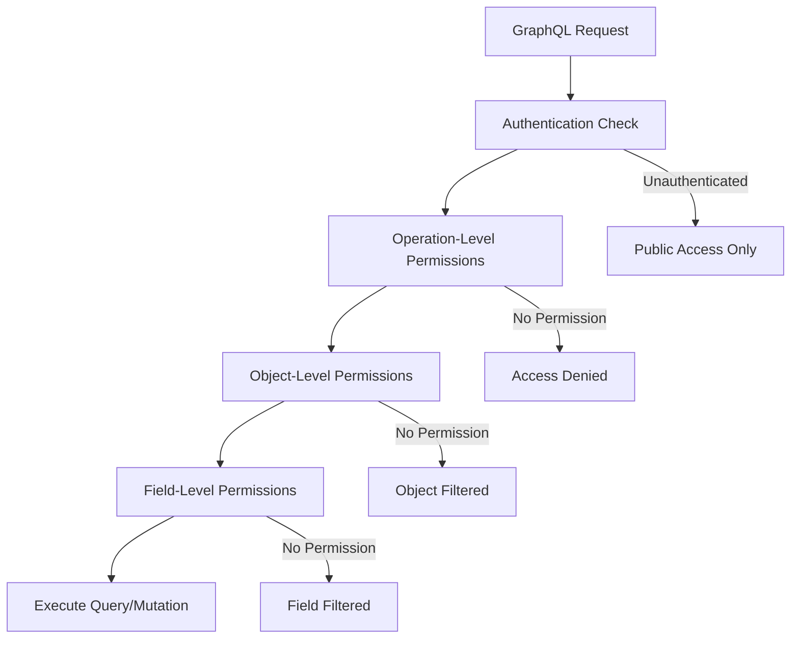

# Permission System Examples

## Overview

This guide provides comprehensive examples for using the permission system in the Django GraphQL Auto-Generation System. The permission system offers multi-level authorization including field-level, object-level, and operation-level permissions with role-based access control.

## 🔐 Permission Architecture

### Permission Levels



### Permission Components

1. **Authentication**: JWT token validation
2. **Operation Permissions**: CRUD operation access control
3. **Object Permissions**: Instance-level access control
4. **Field Permissions**: Field-level access control
5. **Role-Based Access**: Group and role management

## 🎭 Role-Based Access Control

### User Groups and Roles

```graphql
# Query user's permissions and groups
query GetMyPermissions {
  myPermissions {
    user {
      id
      username
      groups {
        id
        name
        permissions {
          id
          name
          codename
          contentType {
            appLabel
            model
          }
        }
      }
    }
    permissions {
      id
      name
      codename
      contentType {
        appLabel
        model
      }
    }
    groups {
      id
      name
    }
    isSuperuser
    isStaff
  }
}
```

**Response:**
```json
{
  "data": {
    "myPermissions": {
      "user": {
        "id": "1",
        "username": "johndoe",
        "groups": [
          {
            "id": "1",
            "name": "Editors",
            "permissions": [
              {
                "id": "25",
                "name": "Can add post",
                "codename": "add_post",
                "contentType": {
                  "appLabel": "blog",
                  "model": "post"
                }
              },
              {
                "id": "26",
                "name": "Can change post",
                "codename": "change_post",
                "contentType": {
                  "appLabel": "blog",
                  "model": "post"
                }
              }
            ]
          }
        ]
      },
      "permissions": [
        {
          "id": "25",
          "name": "Can add post",
          "codename": "add_post",
          "contentType": {
            "appLabel": "blog",
            "model": "post"
          }
        }
      ],
      "groups": [
        {
          "id": "1",
          "name": "Editors"
        }
      ],
      "isSuperuser": false,
      "isStaff": false
    }
  }
}
```

## 📝 Operation-Level Permissions

### CRUD Operations with Permissions

#### Create Permission Example

```graphql
# User with 'add_post' permission
mutation CreatePost {
  createPost(data: {
    title: "New Blog Post"
    content: "This is the content of the new post"
    status: "draft"
  }) {
    ok
    post {
      id
      title
      content
      status
      author {
        username
      }
    }
    errors
  }
}
```

**Response (Success):**
```json
{
  "data": {
    "createPost": {
      "ok": true,
      "post": {
        "id": "10",
        "title": "New Blog Post",
        "content": "This is the content of the new post",
        "status": "draft",
        "author": {
          "username": "johndoe"
        }
      },
      "errors": []
    }
  }
}
```

**Response (No Permission):**
```json
{
  "data": {
    "createPost": {
      "ok": false,
      "post": null,
      "errors": [
        "You do not have permission to create posts"
      ]
    }
  }
}
```

#### Update Permission Example

```graphql
# User with 'change_post' permission
mutation UpdatePost {
  updatePost(id: "10", data: {
    title: "Updated Blog Post Title"
    status: "published"
  }) {
    ok
    post {
      id
      title
      status
      updatedAt
    }
    errors
  }
}
```

**Response (Success):**
```json
{
  "data": {
    "updatePost": {
      "ok": true,
      "post": {
        "id": "10",
        "title": "Updated Blog Post Title",
        "status": "published",
        "updatedAt": "2024-01-15T16:30:00Z"
      },
      "errors": []
    }
  }
}
```

#### Delete Permission Example

```graphql
# User with 'delete_post' permission
mutation DeletePost {
  deletePost(id: "10") {
    ok
    errors
  }
}
```

**Response (No Permission):**
```json
{
  "data": {
    "deletePost": {
      "ok": false,
      "errors": [
        "You do not have permission to delete posts"
      ]
    }
  }
}
```

## 🎯 Object-Level Permissions

### Owner-Based Permissions

```python
# Custom permission class example
class IsOwnerOrReadOnly(BasePermission):
    """
    Permission permettant seulement aux propriétaires d'un objet de le modifier.
    """
    
    def has_object_permission(self, request, view, obj):
        # Permissions de lecture pour tous
        if request.method in ['GET', 'HEAD', 'OPTIONS']:
            return True
        
        # Permissions d'écriture seulement pour le propriétaire
        return obj.author == request.user
```

#### Query with Object Filtering

```graphql
# Only returns posts the user can access
query GetMyPosts {
  posts {
    id
    title
    content
    status
    author {
      username
    }
    canEdit
    canDelete
  }
}
```

**Response:**
```json
{
  "data": {
    "posts": [
      {
        "id": "1",
        "title": "My First Post",
        "content": "Content I can see",
        "status": "published",
        "author": {
          "username": "johndoe"
        },
        "canEdit": true,
        "canDelete": true
      },
      {
        "id": "2",
        "title": "Someone Else's Post",
        "content": "Public content",
        "status": "published",
        "author": {
          "username": "janedoe"
        },
        "canEdit": false,
        "canDelete": false
      }
    ]
  }
}
```

### Staff-Only Content

```graphql
# Query that filters based on staff status
query GetAllUsers {
  users {
    id
    username
    email  # Only visible to staff
    isActive
    dateJoined  # Only visible to staff
  }
}
```

**Response (Non-Staff User):**
```json
{
  "data": {
    "users": [
      {
        "id": "1",
        "username": "johndoe",
        "email": null,
        "isActive": true,
        "dateJoined": null
      }
    ]
  }
}
```

**Response (Staff User):**
```json
{
  "data": {
    "users": [
      {
        "id": "1",
        "username": "johndoe",
        "email": "john@example.com",
        "isActive": true,
        "dateJoined": "2024-01-10T10:00:00Z"
      }
    ]
  }
}
```

## 🔒 Field-Level Permissions

### Sensitive Field Protection

```graphql
# Query with field-level permission filtering
query GetUserProfile {
  me {
    id
    username
    email
    firstName
    lastName
    phoneNumber    # Requires 'view_phone' permission
    socialSecurityNumber  # Requires 'view_ssn' permission
    salary        # Requires 'view_salary' permission
    isActive
  }
}
```

**Response (Basic User):**
```json
{
  "data": {
    "me": {
      "id": "1",
      "username": "johndoe",
      "email": "john@example.com",
      "firstName": "John",
      "lastName": "Doe",
      "phoneNumber": null,
      "socialSecurityNumber": null,
      "salary": null,
      "isActive": true
    }
  }
}
```

**Response (HR User with permissions):**
```json
{
  "data": {
    "me": {
      "id": "1",
      "username": "johndoe",
      "email": "john@example.com",
      "firstName": "John",
      "lastName": "Doe",
      "phoneNumber": "+1-555-0123",
      "socialSecurityNumber": "***-**-1234",
      "salary": "75000.00",
      "isActive": true
    }
  }
}
```

### Dynamic Field Permissions

```graphql
# Query with conditional field visibility
query GetPostDetails($id: ID!) {
  post(id: $id) {
    id
    title
    content
    status
    publishedAt
    author {
      username
    }
    # Admin-only fields
    internalNotes     # Requires 'view_internal_notes'
    moderationFlags   # Requires 'view_moderation'
    analyticsData     # Requires 'view_analytics'
  }
}
```

## 🛡️ Custom Permission Classes

### Implementation Examples

```python
# Custom permission for time-based access
class BusinessHoursPermission(BasePermission):
    """
    Permission qui n'autorise l'accès que pendant les heures ouvrables.
    """
    
    def has_permission(self, request, view):
        from datetime import datetime
        now = datetime.now()
        
        # Heures ouvrables: 9h-17h, lundi-vendredi
        if now.weekday() >= 5:  # Weekend
            return False
        
        if now.hour < 9 or now.hour >= 17:  # En dehors des heures
            return False
        
        return True

# Department-based permission
class DepartmentPermission(BasePermission):
    """
    Permission basée sur le département de l'utilisateur.
    """
    
    def has_object_permission(self, request, view, obj):
        if not hasattr(request.user, 'profile'):
            return False
        
        if not hasattr(obj, 'department'):
            return True
        
        # L'utilisateur peut accéder aux objets de son département
        return request.user.profile.department == obj.department

# Role hierarchy permission
class RoleHierarchyPermission(BasePermission):
    """
    Permission basée sur la hiérarchie des rôles.
    """
    
    ROLE_HIERARCHY = {
        'intern': 1,
        'employee': 2,
        'manager': 3,
        'director': 4,
        'admin': 5
    }
    
    def has_permission(self, request, view):
        if not hasattr(request.user, 'profile'):
            return False
        
        user_role = request.user.profile.role
        required_role = getattr(view, 'required_role', 'employee')
        
        user_level = self.ROLE_HIERARCHY.get(user_role, 0)
        required_level = self.ROLE_HIERARCHY.get(required_role, 0)
        
        return user_level >= required_level
```

### Using Custom Permissions in GraphQL

```python
# Apply custom permissions to specific mutations
class PostMutations(graphene.ObjectType):
    create_post = CreatePostMutation.Field()
    update_post = UpdatePostMutation.Field()
    delete_post = DeletePostMutation.Field()
    
    # Custom permission decorators
    @permission_required('blog.add_post')
    @business_hours_required
    def resolve_create_post(self, info, **kwargs):
        return CreatePostMutation()
    
    @permission_required('blog.change_post')
    @department_permission_required
    def resolve_update_post(self, info, **kwargs):
        return UpdatePostMutation()
```

## 🔍 Permission Validation Examples

### Validation Query

```graphql
# Check if user has specific permissions
query ValidatePermissions {
  validateInput(fieldName: "email", value: "test@example.com") {
    fieldName
    isValid
    errorMessage
    sanitizedValue
  }
}
```

**Response:**
```json
{
  "data": {
    "validateInput": {
      "fieldName": "email",
      "isValid": true,
      "errorMessage": null,
      "sanitizedValue": "test@example.com"
    }
  }
}
```

### Permission Check Query

```graphql
# Check user's permission for specific operations
query CheckPermissions {
  myPermissions {
    user {
      id
      username
    }
    hasPermission(permission: "blog.add_post")
    canCreatePost: hasPermission(permission: "blog.add_post")
    canEditPost: hasPermission(permission: "blog.change_post")
    canDeletePost: hasPermission(permission: "blog.delete_post")
    canViewAnalytics: hasPermission(permission: "analytics.view_data")
  }
}
```

## 🚫 Access Denied Scenarios

### Insufficient Permissions

```graphql
# Attempt to access restricted content
query GetRestrictedData {
  adminOnlyData {
    sensitiveInformation
    systemConfiguration
    userAnalytics
  }
}
```

**Response:**
```json
{
  "errors": [
    {
      "message": "You do not have permission to access this resource",
      "locations": [{"line": 2, "column": 3}],
      "path": ["adminOnlyData"],
      "extensions": {
        "code": "PERMISSION_DENIED",
        "requiredPermission": "admin.view_sensitive_data"
      }
    }
  ],
  "data": {
    "adminOnlyData": null
  }
}
```

### Field-Level Access Denied

```graphql
# Attempt to access restricted fields
query GetUserWithRestrictedFields {
  user(id: "1") {
    username
    email
    salary  # Restricted field
  }
}
```

**Response:**
```json
{
  "data": {
    "user": {
      "username": "johndoe",
      "email": "john@example.com",
      "salary": null
    }
  },
  "extensions": {
    "warnings": [
      {
        "message": "Field 'salary' filtered due to insufficient permissions",
        "field": "salary",
        "requiredPermission": "hr.view_salary"
      }
    ]
  }
}
```

## 🔧 Configuration Examples

### Permission Settings

```python
# Django settings for permission system
GRAPHQL_AUTO_SETTINGS = {
    'PERMISSIONS': {
        'ENABLE_FIELD_PERMISSIONS': True,
        'ENABLE_OBJECT_PERMISSIONS': True,
        'ENABLE_OPERATION_PERMISSIONS': True,
        'DEFAULT_PERMISSION_CLASSES': [
            'django_graphql_auto.extensions.permissions.IsAuthenticated',
            'django_graphql_auto.extensions.permissions.DjangoModelPermissions',
        ],
        'FIELD_PERMISSION_CLASSES': [
            'django_graphql_auto.extensions.permissions.FieldPermissionMixin',
        ],
        'OBJECT_PERMISSION_CLASSES': [
            'django_graphql_auto.extensions.permissions.DjangoObjectPermissions',
        ],
        'PERMISSION_DENIED_MESSAGE': 'You do not have permission to access this resource',
        'FILTER_UNAUTHORIZED_FIELDS': True,
        'FILTER_UNAUTHORIZED_OBJECTS': True,
    }
}
```

### Model-Specific Permissions

```python
# Model with custom permission configuration
class Post(models.Model):
    title = models.CharField(max_length=200, verbose_name="Titre")
    content = models.TextField(verbose_name="Contenu")
    author = models.ForeignKey(User, on_delete=models.CASCADE, verbose_name="Auteur")
    status = models.CharField(max_length=20, choices=STATUS_CHOICES, verbose_name="Statut")
    
    class Meta:
        permissions = [
            ('publish_post', 'Can publish posts'),
            ('feature_post', 'Can feature posts'),
            ('moderate_post', 'Can moderate posts'),
        ]
        
    class GraphQLMeta:
        permissions = {
            'create': ['blog.add_post'],
            'update': ['blog.change_post'],
            'delete': ['blog.delete_post'],
            'view': [],  # Public read access
        }
        field_permissions = {
            'author': ['blog.view_author'],
            'internal_notes': ['blog.view_internal_notes'],
            'moderation_flags': ['blog.moderate_post'],
        }
```

## 🧪 Testing Permissions

### Unit Test Examples

```python
import pytest
from django.test import TestCase
from django.contrib.auth.models import User, Group, Permission
from django.contrib.contenttypes.models import ContentType
from graphene.test import Client
from your_app.schema import schema

class PermissionTestCase(TestCase):
    def setUp(self):
        self.client = Client(schema)
        
        # Create test users
        self.admin_user = User.objects.create_user(
            username='admin',
            email='admin@example.com',
            password='adminpass',
            is_staff=True,
            is_superuser=True
        )
        
        self.editor_user = User.objects.create_user(
            username='editor',
            email='editor@example.com',
            password='editorpass'
        )
        
        self.regular_user = User.objects.create_user(
            username='user',
            email='user@example.com',
            password='userpass'
        )
        
        # Create groups and permissions
        self.editors_group = Group.objects.create(name='Editors')
        
        # Add permissions to group
        content_type = ContentType.objects.get_for_model(Post)
        add_permission = Permission.objects.get(
            codename='add_post',
            content_type=content_type
        )
        change_permission = Permission.objects.get(
            codename='change_post',
            content_type=content_type
        )
        
        self.editors_group.permissions.add(add_permission, change_permission)
        self.editor_user.groups.add(self.editors_group)

    def test_admin_can_access_all_data(self):
        # Simulate admin authentication
        self.client.context = type('Context', (), {'user': self.admin_user})()
        
        query = """
        query GetAllUsers {
            users {
                id
                username
                email
                isStaff
            }
        }
        """
        
        result = self.client.execute(query)
        
        assert 'errors' not in result
        assert len(result['data']['users']) > 0
        assert result['data']['users'][0]['email'] is not None

    def test_regular_user_filtered_data(self):
        # Simulate regular user authentication
        self.client.context = type('Context', (), {'user': self.regular_user})()
        
        query = """
        query GetAllUsers {
            users {
                id
                username
                email
                isStaff
            }
        }
        """
        
        result = self.client.execute(query)
        
        # Regular users should not see email addresses
        assert 'errors' not in result
        for user in result['data']['users']:
            assert user['email'] is None

    def test_editor_can_create_post(self):
        # Simulate editor authentication
        self.client.context = type('Context', (), {'user': self.editor_user})()
        
        mutation = """
        mutation CreatePost {
            createPost(data: {
                title: "Test Post"
                content: "Test content"
                status: "draft"
            }) {
                ok
                post {
                    id
                    title
                }
                errors
            }
        }
        """
        
        result = self.client.execute(mutation)
        
        assert result['data']['createPost']['ok'] is True
        assert len(result['data']['createPost']['errors']) == 0

    def test_regular_user_cannot_create_post(self):
        # Simulate regular user authentication
        self.client.context = type('Context', (), {'user': self.regular_user})()
        
        mutation = """
        mutation CreatePost {
            createPost(data: {
                title: "Test Post"
                content: "Test content"
                status: "draft"
            }) {
                ok
                post {
                    id
                }
                errors
            }
        }
        """
        
        result = self.client.execute(mutation)
        
        assert result['data']['createPost']['ok'] is False
        assert 'permission' in result['data']['createPost']['errors'][0].lower()

    def test_object_level_permissions(self):
        # Create a post owned by editor
        post = Post.objects.create(
            title="Editor's Post",
            content="Content",
            author=self.editor_user,
            status="published"
        )
        
        # Regular user tries to update editor's post
        self.client.context = type('Context', (), {'user': self.regular_user})()
        
        mutation = f"""
        mutation UpdatePost {{
            updatePost(id: "{post.id}", data: {{
                title: "Hacked Title"
            }}) {{
                ok
                errors
            }}
        }}
        """
        
        result = self.client.execute(mutation)
        
        assert result['data']['updatePost']['ok'] is False
        assert 'permission' in result['data']['updatePost']['errors'][0].lower()
```

## 📚 Best Practices

### Security Guidelines

1. **Principle of Least Privilege**: Grant minimum necessary permissions
2. **Defense in Depth**: Implement multiple permission layers
3. **Regular Audits**: Review and update permissions regularly
4. **Clear Documentation**: Document permission requirements clearly
5. **Testing**: Comprehensive permission testing in CI/CD

### Performance Considerations

1. **Permission Caching**: Cache permission checks for better performance
2. **Bulk Permission Checks**: Optimize for multiple object queries
3. **Database Optimization**: Use select_related for permission queries
4. **Lazy Loading**: Load permissions only when needed

### Development Workflow

1. **Permission Planning**: Design permission model early
2. **Incremental Implementation**: Add permissions gradually
3. **Testing Strategy**: Test both positive and negative cases
4. **Documentation**: Keep permission documentation updated

## 📚 Additional Resources

- [Security Overview](../features/security.md)
- [Authentication Examples](authentication-examples.md)
- [Input Validation Guide](validation-examples.md)
- [Security Configuration](../setup/security-configuration.md)