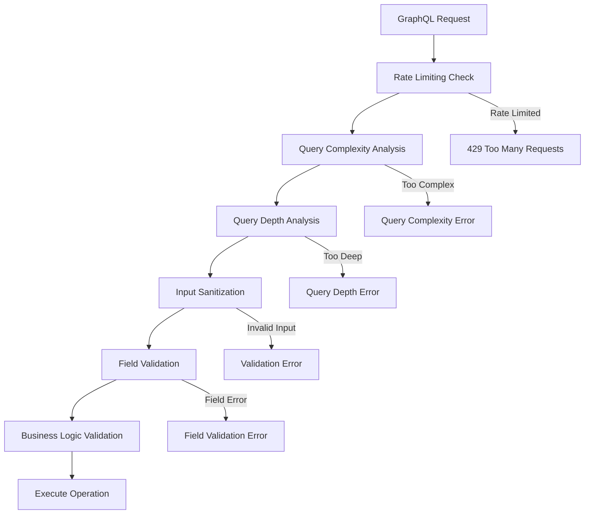

# Input Validation & Security Features Examples

## Overview

This guide provides comprehensive examples for using the input validation and security features in the Django GraphQL Auto-Generation System. The system includes XSS protection, SQL injection prevention, rate limiting, query complexity analysis, and comprehensive input sanitization.

## 🛡️ Input Validation Architecture

### Validation Pipeline



## 🔍 Input Sanitization Examples

### XSS Protection

```graphql
# Attempt to inject malicious script
mutation CreatePostWithXSS {
  createPost(data: {
    title: "<script>alert('XSS')</script>Malicious Title"
    content: "Normal content with "
    description: "javascript:alert('XSS')"
  }) {
    ok
    post {
      id
      title
      content
      description
    }
    errors
  }
}
```

**Response (Sanitized):**
```json
{
  "data": {
    "createPost": {
      "ok": true,
      "post": {
        "id": "15",
        "title": "Malicious Title",
        "content": "Normal content with ",
        "description": "alert('XSS')"
      },
      "errors": []
    }
  }
}
```

### SQL Injection Prevention

```graphql
# Attempt SQL injection in search
query SearchPostsWithSQLInjection {
  posts(filters: {
    title_contains: "'; DROP TABLE posts; --"
    content_contains: "1' OR '1'='1"
  }) {
    id
    title
    content
  }
}
```

**Response (Safe):**
```json
{
  "data": {
    "posts": []
  }
}
```

### Input Validation Query

```graphql
# Validate specific input fields
query ValidateUserInput {
  validateInput(fieldName: "email", value: "test@example.com") {
    fieldName
    isValid
    errorMessage
    sanitizedValue
  }
}
```

**Response:**
```json
{
  "data": {
    "validateInput": {
      "fieldName": "email",
      "isValid": true,
      "errorMessage": null,
      "sanitizedValue": "test@example.com"
    }
  }
}
```

### Invalid Input Validation

```graphql
# Validate invalid email
query ValidateInvalidEmail {
  validateInput(fieldName: "email", value: "<script>alert('xss')</script>invalid-email") {
    fieldName
    isValid
    errorMessage
    sanitizedValue
  }
}
```

**Response:**
```json
{
  "data": {
    "validateInput": {
      "fieldName": "email",
      "isValid": false,
      "errorMessage": "Invalid email format",
      "sanitizedValue": "alert('xss')invalid-email"
    }
  }
}
```

## ⚡ Rate Limiting Examples

### Rate Limit Information

```graphql
# Check current rate limit status
query GetSecurityInfo {
  securityInfo {
    rateLimiting {
      remainingRequests
      windowResetTime
      currentComplexityLimit
      currentDepthLimit
    }
    authentication {
      isAuthenticated
      user {
        username
      }
      tokenExpiresAt
    }
  }
}
```

**Response:**
```json
{
  "data": {
    "securityInfo": {
      "rateLimiting": {
        "remainingRequests": 95,
        "windowResetTime": "2024-01-15T17:00:00Z",
        "currentComplexityLimit": 1000,
        "currentDepthLimit": 10
      },
      "authentication": {
        "isAuthenticated": true,
        "user": {
          "username": "johndoe"
        },
        "tokenExpiresAt": "2024-01-15T18:30:00Z"
      }
    }
  }
}
```

### Rate Limit Exceeded

```graphql
# After exceeding rate limit
query ExceededRateLimit {
  posts {
    id
    title
  }
}
```

**Response:**
```json
{
  "errors": [
    {
      "message": "Rate limit exceeded. Try again in 300 seconds.",
      "locations": [{"line": 2, "column": 3}],
      "path": ["posts"],
      "extensions": {
        "code": "RATE_LIMITED",
        "retryAfter": 300,
        "limit": 100,
        "window": 3600,
        "remaining": 0
      }
    }
  ],
  "data": {
    "posts": null
  }
}
```

### Different Rate Limits by User Type

```graphql
# Authenticated user - higher limits
query AuthenticatedUserQuery {
  securityInfo {
    rateLimiting {
      remainingRequests  # 1000 requests per hour
      windowResetTime
    }
  }
}

# Anonymous user - lower limits  
query AnonymousUserQuery {
  securityInfo {
    rateLimiting {
      remainingRequests  # 100 requests per hour
      windowResetTime
    }
  }
}
```

## 📊 Query Complexity Analysis

### Simple Query (Low Complexity)

```graphql
# Complexity Score: ~5
query SimpleQuery {
  posts {
    id
    title
    status
  }
}
```

### Complex Query (High Complexity)

```graphql
# Complexity Score: ~150
query ComplexQuery {
  posts {
    id
    title
    content
    author {
      id
      username
      profile {
        bio
        avatar
        socialLinks {
          platform
          url
        }
      }
      posts {
        id
        title
        comments {
          id
          content
          author {
            username
          }
        }
      }
    }
    comments {
      id
      content
      author {
        username
        profile {
          bio
        }
      }
      replies {
        id
        content
        author {
          username
        }
      }
    }
    tags {
      id
      name
      posts {
        id
        title
      }
    }
  }
}
```

**Response (Complexity Exceeded):**
```json
{
  "errors": [
    {
      "message": "Query complexity limit exceeded. Maximum allowed: 100, actual: 150",
      "locations": [{"line": 2, "column": 3}],
      "extensions": {
        "code": "QUERY_COMPLEXITY_EXCEEDED",
        "maxComplexity": 100,
        "actualComplexity": 150,
        "suggestions": [
          "Reduce the number of nested fields",
          "Use pagination for list fields",
          "Split into multiple smaller queries"
        ]
      }
    }
  ],
  "data": null
}
```

### Query Complexity Statistics

```graphql
# Get query performance statistics
query GetQueryStats {
  queryStats {
    totalQueries
    avgComplexity
    avgDepth
    avgExecutionTime
    successRate
  }
}
```

**Response:**
```json
{
  "data": {
    "queryStats": {
      "totalQueries": 1250,
      "avgComplexity": 25.5,
      "avgDepth": 4.2,
      "avgExecutionTime": 150.3,
      "successRate": 98.4
    }
  }
}
```

## 🏗️ Query Depth Analysis

### Shallow Query (Acceptable Depth)

```graphql
# Depth: 3 levels
query ShallowQuery {
  posts {           # Level 1
    author {        # Level 2
      username      # Level 3
    }
  }
}
```

### Deep Query (Excessive Depth)

```graphql
# Depth: 8 levels (exceeds limit of 6)
query DeepQuery {
  posts {                    # Level 1
    author {                 # Level 2
      profile {              # Level 3
        company {            # Level 4
          department {       # Level 5
            manager {        # Level 6
              profile {      # Level 7
                avatar       # Level 8
              }
            }
          }
        }
      }
    }
  }
}
```

**Response (Depth Exceeded):**
```json
{
  "errors": [
    {
      "message": "Query depth limit exceeded. Maximum allowed: 6, actual: 8",
      "locations": [{"line": 2, "column": 3}],
      "extensions": {
        "code": "QUERY_DEPTH_EXCEEDED",
        "maxDepth": 6,
        "actualDepth": 8,
        "suggestions": [
          "Reduce nesting levels",
          "Use separate queries for deep relationships",
          "Consider using fragments to optimize structure"
        ]
      }
    }
  ],
  "data": null
}
```

## 🔧 Field-Specific Validation

### Email Validation

```graphql
mutation CreateUserWithValidation {
  createUser(data: {
    username: "newuser"
    email: "invalid-email-format"
    password: "weak"
    firstName: ""
  }) {
    ok
    user {
      id
      username
    }
    errors
  }
}
```

**Response:**
```json
{
  "data": {
    "createUser": {
      "ok": false,
      "user": null,
      "errors": [
        "Email must be a valid email address",
        "Password must be at least 8 characters long",
        "Password must contain at least one uppercase letter",
        "Password must contain at least one number",
        "First name is required"
      ]
    }
  }
}
```

### URL Validation

```graphql
mutation CreateProfileWithURL {
  createProfile(data: {
    website: "javascript:alert('xss')"
    socialMedia: "not-a-url"
    bio: "<script>malicious()</script>Clean bio content"
  }) {
    ok
    profile {
      id
      website
      socialMedia
      bio
    }
    errors
  }
}
```

**Response:**
```json
{
  "data": {
    "createProfile": {
      "ok": false,
      "profile": null,
      "errors": [
        "Website must be a valid URL",
        "Social media must be a valid URL"
      ]
    }
  }
}
```

### Phone Number Validation

```graphql
mutation UpdateUserPhone {
  updateUser(id: "1", data: {
    phoneNumber: "123-invalid-phone"
  }) {
    ok
    user {
      phoneNumber
    }
    errors
  }
}
```

**Response:**
```json
{
  "data": {
    "updateUser": {
      "ok": false,
      "user": null,
      "errors": [
        "Phone number must be in valid format (e.g., +1-555-123-4567)"
      ]
    }
  }
}
```

## 🛠️ Custom Validation Rules

### Business Logic Validation

```graphql
# Custom validation for business rules
mutation CreateOrderWithValidation {
  createOrder(data: {
    items: [
      {productId: "1", quantity: -5},  # Negative quantity
      {productId: "999", quantity: 2}  # Non-existent product
    ]
    shippingAddress: {
      country: "XX"  # Invalid country code
    }
    paymentMethod: "invalid_method"
  }) {
    ok
    order {
      id
    }
    errors
  }
}
```

**Response:**
```json
{
  "data": {
    "createOrder": {
      "ok": false,
      "order": null,
      "errors": [
        "Quantity must be greater than 0",
        "Product with ID 999 does not exist",
        "Invalid country code: XX",
        "Payment method 'invalid_method' is not supported"
      ]
    }
  }
}
```

### Date Range Validation

```graphql
mutation CreateEventWithDates {
  createEvent(data: {
    title: "Conference"
    startDate: "2024-01-20T10:00:00Z"
    endDate: "2024-01-19T15:00:00Z"  # End before start
    registrationDeadline: "2024-01-25T23:59:59Z"  # After event
  }) {
    ok
    event {
      id
    }
    errors
  }
}
```

**Response:**
```json
{
  "data": {
    "createEvent": {
      "ok": false,
      "event": null,
      "errors": [
        "End date must be after start date",
        "Registration deadline must be before event start date"
      ]
    }
  }
}
```

## 🔒 Security Headers and Middleware

### Security Information Query

```graphql
query GetFullSecurityInfo {
  securityInfo {
    rateLimiting {
      remainingRequests
      windowResetTime
      currentComplexityLimit
      currentDepthLimit
    }
    authentication {
      isAuthenticated
      user {
        id
        username
        groups {
          name
        }
      }
      tokenExpiresAt
      sessionExpiresAt
    }
    permissions {
      canCreatePosts
      canEditPosts
      canDeletePosts
      canViewAnalytics
    }
    validation {
      enabledValidators
      customRules
    }
  }
}
```

**Response:**
```json
{
  "data": {
    "securityInfo": {
      "rateLimiting": {
        "remainingRequests": 87,
        "windowResetTime": "2024-01-15T17:00:00Z",
        "currentComplexityLimit": 1000,
        "currentDepthLimit": 10
      },
      "authentication": {
        "isAuthenticated": true,
        "user": {
          "id": "1",
          "username": "johndoe",
          "groups": [
            {"name": "Editors"},
            {"name": "Users"}
          ]
        },
        "tokenExpiresAt": "2024-01-15T18:30:00Z",
        "sessionExpiresAt": "2024-01-15T20:00:00Z"
      },
      "permissions": {
        "canCreatePosts": true,
        "canEditPosts": true,
        "canDeletePosts": false,
        "canViewAnalytics": false
      },
      "validation": {
        "enabledValidators": [
          "XSSValidator",
          "SQLInjectionValidator",
          "EmailValidator",
          "URLValidator",
          "PhoneValidator"
        ],
        "customRules": [
          "BusinessLogicValidator",
          "DateRangeValidator"
        ]
      }
    }
  }
}
```

## 📈 Performance and Security Monitoring

### Query Performance Metrics

```graphql
query GetPerformanceMetrics {
  queryStats {
    totalQueries
    avgComplexity
    avgDepth
    avgExecutionTime
    successRate
    errorBreakdown {
      validationErrors
      permissionErrors
      rateLimitErrors
      complexityErrors
      depthErrors
    }
    topSlowQueries {
      query
      avgExecutionTime
      callCount
    }
  }
}
```

**Response:**
```json
{
  "data": {
    "queryStats": {
      "totalQueries": 5420,
      "avgComplexity": 28.7,
      "avgDepth": 4.1,
      "avgExecutionTime": 145.2,
      "successRate": 97.8,
      "errorBreakdown": {
        "validationErrors": 45,
        "permissionErrors": 23,
        "rateLimitErrors": 12,
        "complexityErrors": 8,
        "depthErrors": 3
      },
      "topSlowQueries": [
        {
          "query": "complexUserAnalytics",
          "avgExecutionTime": 850.5,
          "callCount": 15
        },
        {
          "query": "deepPostsWithComments",
          "avgExecutionTime": 420.3,
          "callCount": 67
        }
      ]
    }
  }
}
```

## 🧪 Testing Security Features

### Security Test Suite

```python
import pytest
from django.test import TestCase
from graphene.test import Client
from your_app.schema import schema

class SecurityTestCase(TestCase):
    def setUp(self):
        self.client = Client(schema)

    def test_xss_protection(self):
        """Test XSS protection in input sanitization"""
        mutation = """
        mutation CreatePostWithXSS {
            createPost(data: {
                title: "<script>alert('xss')</script>Safe Title"
                content: "Content"
            }) {
                ok
                post {
                    title
                    content
                }
                errors
            }
        }
        """
        
        result = self.client.execute(mutation)
        
        # XSS should be sanitized
        assert result['data']['createPost']['ok'] is True
        assert '<script>' not in result['data']['createPost']['post']['title']
        assert 'onerror=' not in result['data']['createPost']['post']['content']

    def test_sql_injection_protection(self):
        """Test SQL injection protection in filters"""
        query = """
        query SearchWithSQLInjection {
            posts(filters: {
                title_contains: "'; DROP TABLE posts; --"
            }) {
                id
                title
            }
        }
        """
        
        result = self.client.execute(query)
        
        # Should not cause SQL injection
        assert 'errors' not in result or 'DROP TABLE' not in str(result.get('errors', []))

    def test_rate_limiting(self):
        """Test rate limiting functionality"""
        query = """
        query TestRateLimit {
            posts {
                id
                title
            }
        }
        """
        
        # Make requests up to the limit
        for i in range(100):  # Assuming limit is 100
            result = self.client.execute(query)
            if i < 99:
                assert 'errors' not in result or 'rate limit' not in str(result.get('errors', [])).lower()
        
        # 101st request should be rate limited
        result = self.client.execute(query)
        assert 'errors' in result
        assert any('rate limit' in str(error).lower() for error in result['errors'])

    def test_query_complexity_limit(self):
        """Test query complexity analysis"""
        complex_query = """
        query VeryComplexQuery {
            posts {
                id
                title
                author {
                    posts {
                        comments {
                            author {
                                posts {
                                    tags {
                                        posts {
                                            id
                                        }
                                    }
                                }
                            }
                        }
                    }
                }
            }
        }
        """
        
        result = self.client.execute(complex_query)
        
        # Should be rejected due to complexity
        assert 'errors' in result
        assert any('complexity' in str(error).lower() for error in result['errors'])

    def test_query_depth_limit(self):
        """Test query depth analysis"""
        deep_query = """
        query VeryDeepQuery {
            posts {
                author {
                    profile {
                        company {
                            department {
                                manager {
                                    profile {
                                        avatar
                                    }
                                }
                            }
                        }
                    }
                }
            }
        }
        """
        
        result = self.client.execute(deep_query)
        
        # Should be rejected due to depth
        assert 'errors' in result
        assert any('depth' in str(error).lower() for error in result['errors'])

    def test_input_validation(self):
        """Test comprehensive input validation"""
        mutation = """
        mutation CreateUserWithInvalidData {
            createUser(data: {
                username: ""
                email: "invalid-email"
                password: "123"
                phoneNumber: "invalid-phone"
            }) {
                ok
                user {
                    id
                }
                errors
            }
        }
        """
        
        result = self.client.execute(mutation)
        
        assert result['data']['createUser']['ok'] is False
        errors = result['data']['createUser']['errors']
        
        # Should have validation errors for each invalid field
        assert any('username' in error.lower() for error in errors)
        assert any('email' in error.lower() for error in errors)
        assert any('password' in error.lower() for error in errors)
        assert any('phone' in error.lower() for error in errors)
```

## 🔧 Configuration Examples

### Security Settings

```python
# Django settings for security features
GRAPHQL_AUTO_SETTINGS = {
    'SECURITY': {
        # Input Validation
        'ENABLE_INPUT_SANITIZATION': True,
        'XSS_PROTECTION': True,
        'SQL_INJECTION_PROTECTION': True,
        'SANITIZATION_RULES': {
            'ALLOWED_TAGS': ['b', 'i', 'u', 'em', 'strong'],
            'ALLOWED_ATTRIBUTES': {},
            'STRIP_COMMENTS': True,
        },
        
        # Rate Limiting
        'RATE_LIMITING': {
            'ENABLE': True,
            'ANONYMOUS_LIMIT': 100,  # requests per hour
            'AUTHENTICATED_LIMIT': 1000,  # requests per hour
            'STAFF_LIMIT': 5000,  # requests per hour
            'WINDOW_SIZE': 3600,  # seconds
            'STORAGE': 'django.core.cache.backends.redis.RedisCache',
        },
        
        # Query Analysis
        'QUERY_ANALYSIS': {
            'ENABLE_COMPLEXITY_ANALYSIS': True,
            'ENABLE_DEPTH_ANALYSIS': True,
            'MAX_COMPLEXITY': 100,
            'MAX_DEPTH': 6,
            'COMPLEXITY_WEIGHTS': {
                'SCALAR_FIELD': 1,
                'OBJECT_FIELD': 2,
                'LIST_FIELD': 5,
                'CONNECTION_FIELD': 10,
            },
        },
        
        # Validation Rules
        'VALIDATION': {
            'EMAIL_VALIDATION': True,
            'URL_VALIDATION': True,
            'PHONE_VALIDATION': True,
            'CUSTOM_VALIDATORS': [
                'your_app.validators.BusinessLogicValidator',
                'your_app.validators.DateRangeValidator',
            ],
        },
        
        # Security Headers
        'SECURITY_HEADERS': {
            'X_CONTENT_TYPE_OPTIONS': 'nosniff',
            'X_FRAME_OPTIONS': 'DENY',
            'X_XSS_PROTECTION': '1; mode=block',
            'REFERRER_POLICY': 'strict-origin-when-cross-origin',
        },
    }
}
```

### Custom Validator Example

```python
# Custom validator implementation
from django_graphql_auto.extensions.validation import BaseValidator

class BusinessLogicValidator(BaseValidator):
    """
    Validateur personnalisé pour la logique métier.
    """
    
    def validate_order_items(self, items):
        """Valide les articles d'une commande."""
        errors = []
        
        for item in items:
            if item.get('quantity', 0) <= 0:
                errors.append("La quantité doit être supérieure à 0")
            
            if not self.product_exists(item.get('productId')):
                errors.append(f"Le produit {item.get('productId')} n'existe pas")
        
        return errors
    
    def validate_date_range(self, start_date, end_date):
        """Valide une plage de dates."""
        if start_date >= end_date:
            return ["La date de fin doit être postérieure à la date de début"]
        
        return []
    
    def product_exists(self, product_id):
        """Vérifie si un produit existe."""
        from your_app.models import Product
        return Product.objects.filter(id=product_id).exists()
```

## 📚 Best Practices

### Security Guidelines

1. **Input Sanitization**: Always sanitize user input
2. **Rate Limiting**: Implement appropriate rate limits
3. **Query Analysis**: Monitor query complexity and depth
4. **Validation**: Use comprehensive field validation
5. **Monitoring**: Track security metrics and errors

### Performance Considerations

1. **Caching**: Cache validation results when possible
2. **Async Processing**: Use async for heavy validation tasks
3. **Database Optimization**: Optimize validation queries
4. **Resource Limits**: Set appropriate resource limits

### Development Workflow

1. **Security First**: Design with security in mind
2. **Testing**: Comprehensive security testing
3. **Monitoring**: Continuous security monitoring
4. **Updates**: Regular security updates and patches

## 📚 Additional Resources

- [Security Overview](../features/security.md)
- [Authentication Examples](authentication-examples.md)
- [Permission Examples](permission-examples.md)
- [Security Configuration](../setup/security-configuration.md)
- [Performance Optimization](../development/performance.md)