# Community Guidelines

## Django GraphQL Auto-Generation System - Community Guidelines

Welcome to the Django GraphQL Auto-Generation System community! These guidelines help create a positive, inclusive, and productive environment for all contributors and users.

## Table of Contents

- [Our Mission](#our-mission)
- [Code of Conduct](#code-of-conduct)
- [Community Values](#community-values)
- [Communication Channels](#communication-channels)
- [Contributing Guidelines](#contributing-guidelines)
- [Community Roles](#community-roles)
- [Recognition and Rewards](#recognition-and-rewards)
- [Conflict Resolution](#conflict-resolution)
- [Events and Meetups](#events-and-meetups)
- [Resources and Support](#resources-and-support)
- [Governance](#governance)

## Our Mission

The Django GraphQL Auto-Generation System community is dedicated to:

- **Democratizing GraphQL**: Making GraphQL accessible to Django developers of all skill levels
- **Fostering Innovation**: Encouraging creative solutions and continuous improvement
- **Building Together**: Creating a collaborative environment where everyone can contribute
- **Sharing Knowledge**: Promoting learning and knowledge sharing across the community
- **Maintaining Quality**: Ensuring high standards in code, documentation, and user experience

## Code of Conduct

### Our Pledge

We pledge to make participation in our community a harassment-free experience for everyone, regardless of:
- Age, body size, visible or invisible disability
- Ethnicity, sex characteristics, gender identity and expression
- Level of experience, education, socio-economic status
- Nationality, personal appearance, race, religion
- Sexual identity and orientation

### Our Standards

**Positive behavior includes:**
- Using welcoming and inclusive language
- Being respectful of differing viewpoints and experiences
- Gracefully accepting constructive criticism
- Focusing on what is best for the community
- Showing empathy towards other community members
- Helping newcomers feel welcome and supported

**Unacceptable behavior includes:**
- Harassment, trolling, or discriminatory comments
- Personal attacks or political arguments
- Publishing others' private information without permission
- Spam, self-promotion without community value
- Any conduct that could reasonably be considered inappropriate

### Enforcement

Community leaders are responsible for clarifying and enforcing standards. They will:
- Remove, edit, or reject comments, commits, code, and other contributions that violate these guidelines
- Communicate reasons for moderation decisions when appropriate
- Take appropriate and fair corrective action in response to violations

**Reporting**: Report violations to community@django-graphql-auto-gen.com

## Community Values

### 🤝 Inclusivity
We welcome contributors from all backgrounds and skill levels. Everyone's perspective adds value to our community.

### 🎓 Learning-Oriented
We encourage questions, experimentation, and learning from mistakes. No question is too basic.

### 🔍 Quality-Focused
We strive for excellence in code, documentation, and user experience while maintaining accessibility.

### 🌟 Innovation-Driven
We embrace new ideas and creative solutions while maintaining stability and reliability.

### 🤲 Collaboration-First
We believe the best solutions come from working together and sharing diverse perspectives.

### 📚 Knowledge-Sharing
We actively share knowledge, best practices, and lessons learned to benefit the entire community.

## Communication Channels

### Primary Channels

**GitHub Discussions** 📋
- **Purpose**: Feature requests, technical discussions, Q&A
- **URL**: https://github.com/your-org/django-graphql-auto-gen/discussions
- **Guidelines**: 
  - Search existing discussions before creating new ones
  - Use clear, descriptive titles
  - Provide context and examples
  - Tag discussions appropriately

**Discord Server** 💬
- **Purpose**: Real-time chat, community support, casual discussions
- **Invite**: https://discord.gg/django-graphql-auto-gen
- **Channels**:
  - `#general` - General community chat
  - `#help` - Technical support and questions
  - `#showcase` - Share your projects and achievements
  - `#contributors` - Contributor coordination
  - `#announcements` - Official project updates

**Stack Overflow** 🔍
- **Purpose**: Technical questions and troubleshooting
- **Tag**: `django-graphql-auto-gen`
- **Guidelines**: Follow Stack Overflow's question guidelines

### Specialized Channels

**Mailing List** 📧
- **Purpose**: Important announcements, security updates
- **Subscribe**: community-announce@django-graphql-auto-gen.com

**Twitter** 🐦
- **Purpose**: News, updates, community highlights
- **Handle**: @DjangoGraphQLGen

**YouTube** 📺
- **Purpose**: Tutorials, conference talks, community content
- **Channel**: Django GraphQL Auto-Gen

### Communication Guidelines

**Be Clear and Concise**
- Use descriptive titles and clear explanations
- Provide relevant context and examples
- Break down complex topics into digestible parts

**Be Respectful**
- Assume positive intent
- Provide constructive feedback
- Acknowledge others' contributions

**Be Helpful**
- Share knowledge and resources
- Help newcomers get started
- Contribute to discussions constructively

## Contributing Guidelines

### Types of Contributions

**Code Contributions** 💻
- Bug fixes and feature implementations
- Performance optimizations
- Test coverage improvements
- Code refactoring and cleanup

**Documentation** 📝
- API documentation improvements
- Tutorial and guide creation
- Translation efforts
- Example projects and demos

**Community Support** 🤝
- Answering questions in forums
- Helping with troubleshooting
- Mentoring new contributors
- Organizing community events

**Testing and Quality Assurance** 🧪
- Bug reporting and reproduction
- Testing new features and releases
- Performance testing and benchmarking
- Security auditing

### Getting Started

**For New Contributors:**

1. **Read the Documentation**
   - Start with the [Getting Started Guide](../getting-started.md)
   - Review the [Contributing Guide](../CONTRIBUTING.md)
   - Understand the [Code Style Guide](code-style-guide.md)

2. **Set Up Your Environment**
   - Fork the repository
   - Set up development environment
   - Run tests to ensure everything works

3. **Find Your First Issue**
   - Look for issues labeled `good-first-issue`
   - Check the `help-wanted` label for opportunities
   - Ask in Discord for guidance on where to start

4. **Make Your First Contribution**
   - Start small with documentation or simple bug fixes
   - Follow the pull request process
   - Engage with reviewers constructively

### Contribution Process

```mermaid
graph TD
    A[Identify Issue/Feature] --> B[Discuss in Community]
    B --> C[Create Issue/RFC]
    C --> D[Get Feedback]
    D --> E[Implement Solution]
    E --> F[Create Pull Request]
    F --> G[Code Review]
    G --> H{Approved?}
    H -->|Yes| I[Merge]
    H -->|No| J[Address Feedback]
    J --> G
    I --> K[Celebrate! 🎉]
```

## Community Roles

### Contributors 👥
**Anyone who participates in the community**
- Submit issues and feature requests
- Participate in discussions
- Help others in forums
- Share knowledge and experiences

**Recognition**: Listed in contributors file, community shoutouts

### Regular Contributors 🌟
**Active community members with ongoing contributions**
- Consistent code or documentation contributions
- Regular participation in community discussions
- Help with issue triage and support

**Recognition**: Special badge in Discord, featured in newsletters

### Core Contributors 🚀
**Trusted community members with significant impact**
- Major feature implementations
- Significant documentation contributions
- Community leadership and mentoring
- Long-term commitment to the project

**Recognition**: Core contributor status, input on project direction

### Maintainers 🔧
**Community leaders responsible for project oversight**
- Code review and merge permissions
- Release management
- Community moderation
- Strategic decision making

**Selection**: Nominated by community, approved by existing maintainers

### Project Leads 👑
**Overall project direction and governance**
- Final decision authority on major changes
- Community representation
- Partnership and collaboration decisions
- Long-term vision and strategy

## Recognition and Rewards

### Contribution Recognition

**Monthly Highlights** 🌟
- Featured contributor spotlights
- Contribution summaries in newsletters
- Social media recognition

**Annual Awards** 🏆
- Outstanding Contributor Award
- Innovation Award
- Community Champion Award
- Mentor of the Year Award

**Swag and Rewards** 🎁
- Contributor t-shirts and stickers
- Conference speaking opportunities
- Priority access to beta features
- Exclusive community events

### Hall of Fame

We maintain a [Hall of Fame](hall-of-fame.md) recognizing:
- First-time contributors
- Major milestone achievements
- Long-term community members
- Special contributions and innovations

## Conflict Resolution

### Resolution Process

**Step 1: Direct Communication** 💬
- Attempt to resolve conflicts directly and respectfully
- Assume positive intent and seek understanding
- Focus on the issue, not personal attributes

**Step 2: Community Mediation** 🤝
- Involve a neutral community member or moderator
- Use structured discussion to find common ground
- Document agreements and next steps

**Step 3: Formal Review** ⚖️
- Escalate to the Community Council for formal review
- Present evidence and perspectives fairly
- Accept binding decisions from the council

### Prevention Strategies

**Clear Communication** 📢
- Use clear, respectful language
- Provide context and rationale for decisions
- Listen actively to different perspectives

**Transparent Processes** 🔍
- Document decision-making processes
- Share rationale for major changes
- Provide opportunities for community input

**Regular Check-ins** 📅
- Conduct regular community surveys
- Hold open forums for feedback
- Address concerns proactively

## Events and Meetups

### Regular Events

**Monthly Community Calls** 📞
- **When**: First Thursday of each month, 2 PM UTC
- **Format**: Video conference with screen sharing
- **Agenda**: Project updates, community Q&A, feature discussions
- **Recording**: Available on YouTube

**Quarterly Contributor Sync** 🤝
- **When**: Last Friday of each quarter
- **Format**: Extended video conference
- **Focus**: Roadmap planning, contributor recognition, deep dives

**Annual Community Conference** 🎪
- **When**: Fall (date varies by year)
- **Format**: Multi-day virtual/hybrid event
- **Content**: Talks, workshops, networking, roadmap sessions

### Special Events

**Hacktoberfest Participation** 🎃
- Special issues prepared for new contributors
- Mentorship program for participants
- Recognition for quality contributions

**Release Parties** 🎉
- Celebrate major releases with community events
- Showcase new features and improvements
- Thank contributors and supporters

**Workshop Series** 🛠️
- Regular educational workshops
- Topics: GraphQL best practices, Django integration, performance optimization
- Led by community experts and maintainers

### Organizing Local Meetups

**Support Available:**
- Presentation materials and templates
- Speaker coordination assistance
- Promotional support through official channels
- Swag and materials for events

**Requirements:**
- Follow Code of Conduct
- Share event details with community
- Provide feedback and photos for promotion
- Welcome all skill levels and backgrounds

## Resources and Support

### Learning Resources

**Official Documentation** 📚
- Comprehensive guides and tutorials
- API reference and examples
- Best practices and patterns
- Troubleshooting guides

**Community-Created Content** 🎨
- Blog posts and articles
- Video tutorials and courses
- Example projects and templates
- Conference talks and presentations

**Mentorship Program** 👨‍🏫
- Pair new contributors with experienced mentors
- Structured learning paths
- Regular check-ins and guidance
- Focus on both technical and community skills

### Support Channels

**Technical Support** 🔧
- GitHub Issues for bug reports
- Stack Overflow for questions
- Discord for real-time help
- Documentation for self-service

**Community Support** 🤗
- Discord for general chat and networking
- Mentorship program for guidance
- Regular community calls for connection
- Local meetups for in-person interaction

**Professional Support** 💼
- Commercial support options available
- Consulting services for implementation
- Training programs for teams
- Custom development services

### Accessibility

**Inclusive Design** ♿
- Documentation available in multiple formats
- Video content includes captions
- Community events accommodate different time zones
- Multiple communication channels for different preferences

**Language Support** 🌍
- Documentation translation efforts
- Multilingual community channels
- International community representatives
- Cultural sensitivity in communications

## Governance

### Decision Making

**Consensus Building** 🤝
- Seek community input on major decisions
- Use RFC process for significant changes
- Allow time for discussion and feedback
- Document decisions and rationale

**Voting Procedures** 🗳️
- Core contributors vote on major changes
- Simple majority for most decisions
- Supermajority (2/3) for governance changes
- Transparent voting process and results

**Appeal Process** ⚖️
- Community members can appeal decisions
- Independent review by Community Council
- Fair hearing for all perspectives
- Binding resolution process

### Community Council

**Composition** 👥
- 5 elected community representatives
- 2 project maintainers
- 1 external advisor (optional)

**Responsibilities** 📋
- Resolve community conflicts
- Review governance changes
- Oversee Code of Conduct enforcement
- Represent community interests

**Elections** 🗳️
- Annual elections for community representatives
- Open nominations from community
- Transparent voting process
- Term limits to ensure fresh perspectives

### Transparency

**Public Records** 📊
- Meeting minutes and decisions published
- Financial information (if applicable) shared
- Governance changes documented
- Community feedback incorporated

**Regular Reporting** 📈
- Quarterly community reports
- Annual state of the project address
- Transparent roadmap and progress updates
- Open discussion of challenges and successes

## Getting Involved

### Immediate Actions

1. **Join Our Channels** 📱
   - Star the GitHub repository
   - Join our Discord server
   - Follow us on social media
   - Subscribe to announcements

2. **Introduce Yourself** 👋
   - Share your background and interests
   - Tell us how you plan to use the project
   - Ask questions and engage with others
   - Offer your skills and expertise

3. **Start Contributing** 🚀
   - Review open issues and discussions
   - Improve documentation
   - Help answer questions
   - Share your experiences and use cases

### Long-term Engagement

**Build Relationships** 🤝
- Participate regularly in community discussions
- Attend community events and meetups
- Mentor newcomers and share knowledge
- Collaborate on projects and initiatives

**Grow Your Impact** 📈
- Take on larger contributions and responsibilities
- Lead community initiatives and projects
- Represent the community at conferences and events
- Help shape the project's future direction

**Give Back** 💝
- Share your success stories and case studies
- Contribute to community resources and documentation
- Support and encourage other contributors
- Help maintain a positive and inclusive environment

---

## Contact Information

**General Inquiries**: community@django-graphql-auto-gen.com
**Code of Conduct Reports**: conduct@django-graphql-auto-gen.com
**Security Issues**: security@django-graphql-auto-gen.com
**Media and Press**: press@django-graphql-auto-gen.com

**Community Managers**:
- Sarah Johnson (@sarahj) - Community Lead
- Michael Chen (@mchen) - Developer Relations
- Elena Rodriguez (@erodriguez) - Documentation Lead

---

Thank you for being part of our community! Together, we're building something amazing that will benefit Django and GraphQL developers worldwide. Your participation, whether big or small, makes a difference and is deeply appreciated.

*Last updated: [Current Date]*
*Version: 1.0*