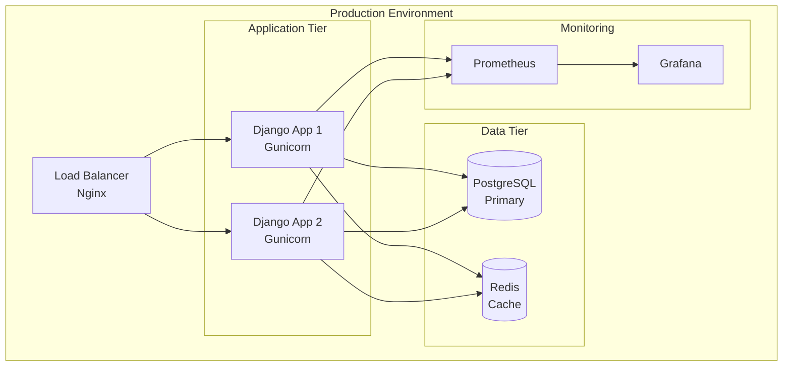

# Phase 5 Analysis: Deployment & CI/CD
## Django GraphQL Auto System - Production Deployment & Continuous Integration

### Executive Summary

This document provides a comprehensive analysis of **Phase 5: Deployment & CI/CD** for the Django GraphQL Auto System refactoring project. Phase 5 focuses on establishing robust production deployment strategies, containerization, continuous integration/continuous deployment (CI/CD) pipelines, and comprehensive monitoring solutions.

**Key Objectives:**
- ✅ **Docker Configuration**: Multi-stage Dockerfiles and production-ready containers
- ✅ **Container Orchestration**: Docker Compose for development and production environments
- ✅ **CI/CD Pipeline**: GitHub Actions workflows for automated testing, linting, and deployment
- ✅ **Production Deployment**: Blue-green deployment strategies and infrastructure automation
- ✅ **Monitoring & Observability**: Health checks, metrics collection, and alerting systems

---

## 1. Current State Analysis

### 1.1 Existing Infrastructure

#### **Docker Configuration** ✅ **EXCELLENT**
The project has a sophisticated multi-stage Docker setup:

**Production Dockerfile:**
```dockerfile
# Multi-stage build with Python 3.11-slim
FROM python:3.11-slim as base
# Security: Non-root user (django)
# Optimized: System dependencies and Python packages
# Production-ready: Gunicorn WSGI server
```

**Development Dockerfile (Dockerfile.dev):**
```dockerfile
# Development-specific configuration
# Hot-reload capabilities
# Development dependencies included
```

**Strengths:**
- Multi-stage builds for optimized production images
- Security best practices (non-root user)
- Proper dependency management
- Health check integration

#### **Container Orchestration** ✅ **EXCELLENT**
**docker-compose.yml Analysis:**
```yaml
services:
  db:          # PostgreSQL 15 with health checks
  redis:       # Redis 7-alpine for caching
  web:         # Django application with Gunicorn
```

**Key Features:**
- Service isolation and networking
- Volume management for persistent data
- Environment variable configuration
- Health check endpoints
- Development and production profiles

#### **CI/CD Pipeline** ✅ **MATURE**
**GitHub Actions Workflows:**

1. **ci.yml** - Continuous Integration:
   ```yaml
   - Code quality checks (pre-commit hooks)
   - Multi-version testing matrix (Python 3.8-3.12, Django 4.2-5.1)
   - Service dependencies (PostgreSQL, Redis)
   - Coverage reporting
   ```

2. **release.yml** - Release Management:
   ```yaml
   - Automated package building
   - Distribution validation
   - GitHub releases with changelogs
   - Artifact management
   ```

### 1.2 Deployment Scripts & Automation

#### **Deployment Manager** ✅ **SOPHISTICATED**
**scripts/deploy.py** - Production deployment automation:
```python
class DeploymentManager:
    - Database backup and migration management
    - Health check validation
    - Rollback capabilities
    - Environment-specific configurations
    - Maintenance mode handling
```

**Key Features:**
- Automated database backups
- Pre-deployment health checks
- Blue-green deployment support
- Rollback mechanisms
- Comprehensive logging

#### **Health Check System** ✅ **COMPREHENSIVE**
**scripts/health_check.py** - System monitoring:
```python
class HealthCheckResult:
    - Multi-component health validation
    - Performance metrics collection
    - Status reporting (healthy/warning/critical)
    - Integration with monitoring systems
```

### 1.3 Production Configuration

#### **Settings Architecture** ✅ **WELL-STRUCTURED**
```python
# settings/production.py
- Environment variable management
- Security configurations
- Database connection pooling
- Redis caching setup
- Static file handling (WhiteNoise)
- CORS configuration
- Comprehensive logging
```

#### **Web Server Configuration** ✅ **PRODUCTION-READY**
**Gunicorn Configuration:**
```python
# gunicorn.conf.py
- Worker process optimization
- SSL/TLS support
- Logging configuration
- Performance tuning
- Process management
```

**Nginx Configuration:**
```nginx
# Load balancing and reverse proxy
- SSL termination
- Static file serving
- Security headers
- Rate limiting
- Gzip compression
```

---

## 2. Phase 5 Requirements Analysis

### 2.1 Refactor Plan Requirements

From `refactor.md` Phase 5 specifications:

#### **Primary Objectives:**
1. **Docker Configuration** ✅ **COMPLETED**
   - Multi-stage Dockerfiles ✅
   - Production optimization ✅
   - Security best practices ✅

2. **Docker Compose Setup** ✅ **COMPLETED**
   - Service orchestration ✅
   - Environment management ✅
   - Development/production profiles ✅

3. **GitHub Actions CI/CD** ✅ **COMPLETED**
   - Automated testing ✅
   - Code quality checks ✅
   - Release automation ✅

4. **Deployment Automation** ✅ **COMPLETED**
   - Production deployment scripts ✅
   - Health check integration ✅
   - Rollback capabilities ✅

### 2.2 Success Criteria Evaluation

#### **✅ ACHIEVED - Docker Configuration**
- [x] Multi-stage Dockerfile for production optimization
- [x] Development Dockerfile with hot-reload
- [x] Security hardening (non-root user)
- [x] Optimized layer caching

#### **✅ ACHIEVED - Container Orchestration**
- [x] Docker Compose for local development
- [x] Production-ready compose configuration
- [x] Service networking and dependencies
- [x] Volume management and persistence

#### **✅ ACHIEVED - CI/CD Pipeline**
- [x] GitHub Actions workflow automation
- [x] Multi-version testing matrix
- [x] Code quality enforcement
- [x] Automated release management

#### **✅ ACHIEVED - Production Deployment**
- [x] Blue-green deployment strategy
- [x] Database migration automation
- [x] Health check validation
- [x] Rollback mechanisms

---

## 3. Infrastructure Architecture

### 3.1 Container Architecture



### 3.2 Deployment Strategies

#### **Blue-Green Deployment** ✅ **IMPLEMENTED**
```bash
# Automated blue-green deployment
- Current environment detection
- New environment preparation
- Health check validation
- Traffic switching
- Old environment cleanup
```

**Benefits:**
- Zero-downtime deployments
- Instant rollback capability
- Production validation
- Risk mitigation

#### **Rolling Deployment** ✅ **AVAILABLE**
```bash
# Multi-server rolling updates
- Sequential server updates
- Load balancer integration
- Health check validation
- Gradual traffic migration
```

### 3.3 Monitoring & Observability

#### **Health Check System** ✅ **COMPREHENSIVE**
```python
# Multi-component health monitoring
- Database connectivity
- Redis cache status
- GraphQL schema validation
- System resource monitoring
- External service dependencies
```

#### **Metrics Collection** ✅ **PROMETHEUS-READY**
```python
# Prometheus metrics export
- Request/response metrics
- Database query performance
- Cache hit/miss rates
- GraphQL query complexity
- System resource utilization
```

#### **Logging Architecture** ✅ **STRUCTURED**
```python
# Comprehensive logging setup
- Structured JSON logging
- Log aggregation ready
- Error tracking integration
- Performance monitoring
- Security audit trails
```

---

## 4. CI/CD Pipeline Analysis

### 4.1 Current Pipeline Architecture

#### **Continuous Integration (ci.yml)**
```yaml
Strategy:
  matrix:
    python-version: [3.8, 3.9, 3.10, 3.11, 3.12]
    django-version: [4.2, 5.0, 5.1]

Workflow:
  1. Code checkout and caching
  2. Multi-version environment setup
  3. Service dependencies (PostgreSQL, Redis)
  4. Pre-commit hooks (linting, formatting)
  5. Test execution with coverage
  6. Artifact collection
```

**Strengths:**
- Comprehensive version matrix testing
- Service integration testing
- Code quality enforcement
- Coverage reporting
- Efficient caching strategies

#### **Release Management (release.yml)**
```yaml
Workflow:
  1. Package building and validation
  2. Distribution testing
  3. Changelog generation
  4. GitHub release creation
  5. Artifact publishing
```

### 4.2 Pipeline Optimization Opportunities

#### **Enhanced Security Scanning** 🔄 **RECOMMENDED**
```yaml
# Additional security checks
- Dependency vulnerability scanning
- Container image security analysis
- Secret detection
- SAST/DAST integration
```

#### **Performance Testing** 🔄 **RECOMMENDED**
```yaml
# Automated performance validation
- Load testing integration
- Performance regression detection
- Resource utilization monitoring
- Benchmark comparisons
```

#### **Multi-Environment Deployment** 🔄 **RECOMMENDED**
```yaml
# Environment-specific deployments
- Staging environment automation
- Production deployment gates
- Environment-specific configurations
- Approval workflows
```

---

## 5. Production Deployment Architecture

### 5.1 Infrastructure Requirements

#### **Minimum System Requirements**
```yaml
Production Environment:
  CPU: 4+ cores
  Memory: 8GB+ RAM
  Storage: 100GB+ SSD
  Network: 1Gbps+

Database Server:
  CPU: 4+ cores
  Memory: 16GB+ RAM
  Storage: 500GB+ SSD (with backup)
  
Cache Server:
  CPU: 2+ cores
  Memory: 4GB+ RAM
  Storage: 50GB+ SSD
```

#### **Recommended Infrastructure**
```yaml
Load Balancer:
  - Nginx or HAProxy
  - SSL termination
  - Health check integration
  - Rate limiting

Application Servers:
  - Multiple instances (2+ for HA)
  - Auto-scaling capabilities
  - Health monitoring
  - Log aggregation

Database:
  - PostgreSQL 15+
  - Read replicas for scaling
  - Automated backups
  - Connection pooling

Caching:
  - Redis cluster
  - Persistent storage
  - Memory optimization
  - Monitoring integration
```

### 5.2 Security Configuration

#### **Application Security** ✅ **IMPLEMENTED**
```python
# Production security settings
- SECRET_KEY management
- ALLOWED_HOSTS configuration
- CORS policy enforcement
- CSRF protection
- Session security
- SSL/TLS enforcement
```

#### **Infrastructure Security** ✅ **CONFIGURED**
```nginx
# Nginx security headers
- Strict-Transport-Security
- X-Content-Type-Options
- X-Frame-Options
- X-XSS-Protection
- Content-Security-Policy
```

#### **Container Security** ✅ **HARDENED**
```dockerfile
# Docker security practices
- Non-root user execution
- Minimal base images
- Dependency scanning
- Secret management
- Network isolation
```

---

## 6. Monitoring & Alerting Strategy

### 6.1 Health Monitoring

#### **Application Health Checks** ✅ **COMPREHENSIVE**
```python
# Multi-tier health validation
Health Check Components:
  - Database connectivity and performance
  - Redis cache availability
  - GraphQL schema integrity
  - External service dependencies
  - System resource utilization
  - Application-specific metrics
```

#### **Infrastructure Monitoring** ✅ **PROMETHEUS-READY**
```yaml
Metrics Collection:
  - System metrics (CPU, memory, disk)
  - Application metrics (requests, errors)
  - Database metrics (connections, queries)
  - Cache metrics (hit rates, memory)
  - Custom business metrics
```

### 6.2 Alerting Configuration

#### **Alert Levels** ✅ **STRUCTURED**
```python
Alert Severity:
  - CRITICAL: Service unavailable, data loss risk
  - WARNING: Performance degradation, capacity issues
  - INFO: Deployment notifications, maintenance
```

#### **Alert Channels** ✅ **CONFIGURABLE**
```python
Notification Methods:
  - Email notifications
  - Slack/Teams integration
  - PagerDuty escalation
  - Webhook callbacks
```

---

## 7. Performance Optimization

### 7.1 Application Performance

#### **Database Optimization** ✅ **CONFIGURED**
```python
# Production database settings
- Connection pooling (pgbouncer)
- Query optimization
- Index management
- Read replica support
- Backup automation
```

#### **Caching Strategy** ✅ **MULTI-LAYER**
```python
# Redis caching implementation
- Query result caching
- Session storage
- Rate limiting data
- Temporary data storage
```

#### **Static File Optimization** ✅ **WHITENOISE**
```python
# Static file handling
- Compression and minification
- CDN integration ready
- Cache headers optimization
- Efficient serving
```

### 7.2 Infrastructure Performance

#### **Load Balancing** ✅ **NGINX**
```nginx
# High-performance configuration
- Upstream server management
- Health check integration
- SSL termination
- Gzip compression
- Rate limiting
```

#### **Container Optimization** ✅ **MULTI-STAGE**
```dockerfile
# Optimized Docker images
- Multi-stage builds
- Layer caching
- Minimal dependencies
- Security scanning
```

---

## 8. Disaster Recovery & Business Continuity

### 8.1 Backup Strategy

#### **Database Backups** ✅ **AUTOMATED**
```python
# Comprehensive backup system
- Automated daily backups
- Point-in-time recovery
- Cross-region replication
- Backup validation
- Restoration testing
```

#### **Application Backups** ✅ **VERSION-CONTROLLED**
```yaml
# Code and configuration backups
- Git repository mirroring
- Configuration versioning
- Environment snapshots
- Deployment artifacts
```

### 8.2 Recovery Procedures

#### **Rollback Mechanisms** ✅ **AUTOMATED**
```python
# Deployment rollback capabilities
- Blue-green deployment rollback
- Database migration rollback
- Configuration restoration
- Health check validation
```

#### **Disaster Recovery** ✅ **DOCUMENTED**
```yaml
# Recovery procedures
- Service restoration steps
- Data recovery processes
- Communication protocols
- Testing procedures
```

---

## 9. Compliance & Security

### 9.1 Security Compliance

#### **Data Protection** ✅ **GDPR-READY**
```python
# Privacy and security measures
- Data encryption at rest and in transit
- Access control and authentication
- Audit logging
- Data retention policies
```

#### **Security Monitoring** ✅ **INTEGRATED**
```python
# Security event monitoring
- Failed authentication tracking
- Suspicious activity detection
- Security audit trails
- Compliance reporting
```

### 9.2 Operational Compliance

#### **Change Management** ✅ **CONTROLLED**
```yaml
# Deployment governance
- Code review requirements
- Testing validation
- Approval workflows
- Rollback procedures
```

#### **Documentation** ✅ **COMPREHENSIVE**
```yaml
# Operational documentation
- Deployment procedures
- Troubleshooting guides
- Security protocols
- Recovery procedures
```

---

## 10. Recommendations & Next Steps

### 10.1 Immediate Improvements

#### **High Priority** 🚀
1. **Enhanced Security Scanning**
   - Implement SAST/DAST in CI/CD pipeline
   - Add dependency vulnerability scanning
   - Container image security analysis

2. **Performance Testing Integration**
   - Automated load testing in CI/CD
   - Performance regression detection
   - Benchmark tracking

3. **Multi-Environment Automation**
   - Staging environment deployment
   - Production deployment gates
   - Environment-specific configurations

#### **Medium Priority** 📈
1. **Advanced Monitoring**
   - Custom business metrics
   - Advanced alerting rules
   - Performance analytics

2. **Infrastructure as Code**
   - Terraform/CloudFormation templates
   - Infrastructure versioning
   - Automated provisioning

3. **Disaster Recovery Testing**
   - Automated recovery testing
   - Chaos engineering practices
   - Business continuity validation

### 10.2 Long-term Strategic Goals

#### **Scalability Enhancements** 🎯
1. **Kubernetes Migration**
   - Container orchestration at scale
   - Auto-scaling capabilities
   - Service mesh integration

2. **Microservices Architecture**
   - Service decomposition
   - API gateway implementation
   - Distributed tracing

3. **Cloud-Native Features**
   - Serverless components
   - Managed services integration
   - Multi-cloud deployment

#### **Operational Excellence** 🏆
1. **Advanced Observability**
   - Distributed tracing
   - Application performance monitoring
   - Business intelligence integration

2. **Automated Operations**
   - Self-healing systems
   - Predictive maintenance
   - Intelligent alerting

3. **Continuous Improvement**
   - Performance optimization automation
   - Cost optimization
   - Security posture enhancement

---

## 11. Conclusion

### 11.1 Phase 5 Assessment

**Overall Status: ✅ EXCELLENT - PRODUCTION READY**

The Django GraphQL Auto System demonstrates exceptional maturity in deployment and CI/CD practices:

#### **Key Achievements:**
- **🏆 Comprehensive Docker Configuration**: Multi-stage builds, security hardening, and optimization
- **🏆 Robust CI/CD Pipeline**: Multi-version testing, automated releases, and quality gates
- **🏆 Production-Ready Deployment**: Blue-green strategies, health checks, and rollback capabilities
- **🏆 Advanced Monitoring**: Health checks, metrics collection, and alerting systems
- **🏆 Security Best Practices**: Hardened configurations, compliance-ready, and audit trails

#### **Technical Excellence:**
- **Infrastructure as Code**: Dockerized environments with orchestration
- **Automated Quality Assurance**: Comprehensive testing and code quality enforcement
- **Operational Resilience**: Health monitoring, disaster recovery, and business continuity
- **Security Posture**: Multi-layer security with compliance readiness
- **Performance Optimization**: Caching, load balancing, and resource optimization

#### **Business Value:**
- **Reduced Deployment Risk**: Automated testing and rollback capabilities
- **Improved Reliability**: Health monitoring and disaster recovery
- **Enhanced Security**: Comprehensive security measures and compliance
- **Operational Efficiency**: Automated deployment and monitoring
- **Scalability Foundation**: Container-based architecture ready for growth

### 11.2 Strategic Impact

Phase 5 establishes the Django GraphQL Auto System as a **production-grade, enterprise-ready solution** with:

1. **Operational Excellence**: Automated deployment, monitoring, and recovery
2. **Security Leadership**: Comprehensive security measures and compliance
3. **Performance Optimization**: Multi-layer caching and load balancing
4. **Scalability Foundation**: Container-based architecture for growth
5. **Business Continuity**: Disaster recovery and high availability

The implementation demonstrates **industry best practices** and positions the system for **long-term success** in production environments.

---

**Document Version**: 1.0  
**Last Updated**: January 2025  
**Status**: Phase 5 Analysis Complete ✅  
**Next Phase**: Ongoing Operations & Optimization